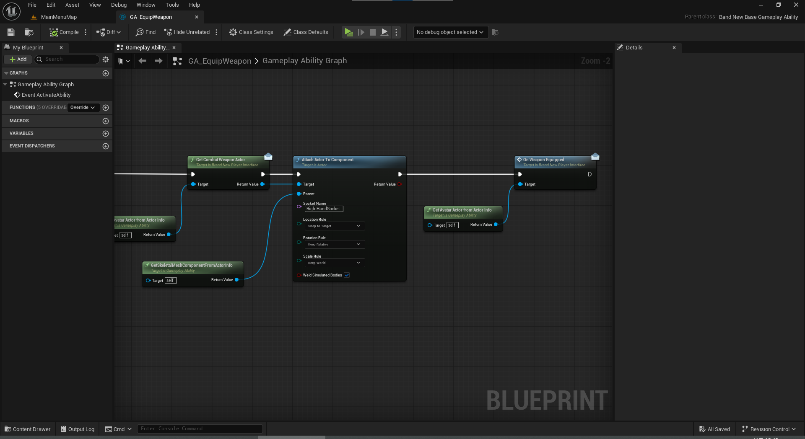
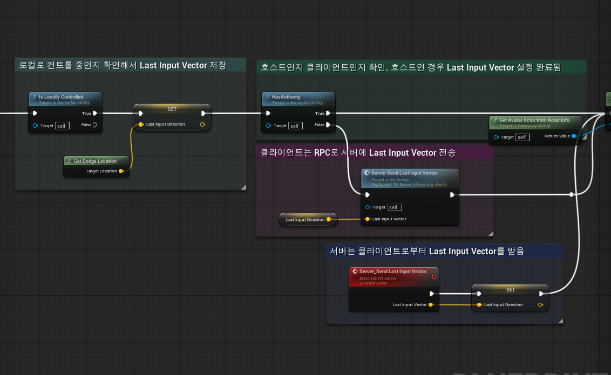
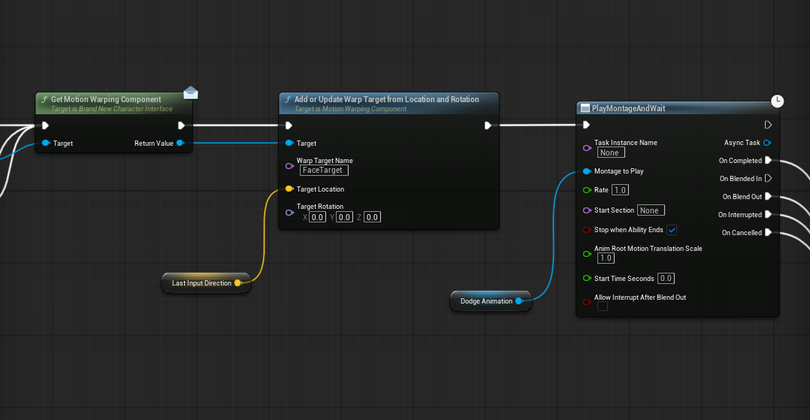

## 01. 목차
- [01. 목차](#01-목차)
- [02. 개요](#02-개요)
- [03. 플레이어 어빌리티](#03-플레이어-어빌리티)
- [04. 에너미 어빌리티](#04-에너미-어빌리티)
---

## 02. 개요
본 프로젝트에서 플레이어와 에너미가 사용하는 어빌리티를 정리한 문서입니다.<br> 
플레이어의 어빌리티와 에너미의 어빌리티가 나누어져 있기는 하지만 대부분의 어빌리티는 플레이어와 에너미 모두 공용으로 사용할 수 있게 제작하였습니다.

---

## 03. 플레이어 어빌리티
- [03-1  Equip](#03-1-equip-ability)
- [03-2  Lock On](#03-2-lockon-ability)
- [03-2  Lock On](#03-2-lockon-ability)
- [03-3  Dodge](#03-3-구르기-ability)
- [03-4  근접 공격](#03-4-근접-공격-ability)
- [03-5  원거리 공격](#03-5-원거리-공격-ability)

> Github Link
> - [캐릭터의 어빌리티를 저장하는 데이터 에셋](https://github.com/jinjinchoi/BrandnewGame/blob/main/Source/CoreModule/Public/DataAssets/DataAsset_DefaultPlayerAbilities.h)  

플레이어의 어빌리티는 데이터 에셋에 설정하며 게임 시작시 서버측에서 데이터 에셋을 순회하여 Ability를 부여합니다.

### 03-1 Equip Ability
Equip Ability는 캐릭터에 무기를 장착시키는데 이때 Mapping Context와 애니메이션 레이어를 바꾸어 추가적인 입력을 할 수 있게 해주고 캐릭터의 애니메이션을 바꾸는 역할을 합니다.

```c++
UPROPERTY(Replicated)
TObjectPtr<ABrandNewWeapon> CombatWeapon;
```

무기는 서버에서 생성한 후 클라이언트로 복제가 이루어집니다.



Equip 어빌리티에서는 이 컴뱃 웨폰을 가져와 소켓에 Attach 하는 작업을 한 뒤 캐릭터 클래스에 무기를 장착했다고 알려줍니다.

```c++
// Player Character Class.h

/* 현재 장착중인 무기의 종류를 나타내는 enum */
ECombatWeaponType EquippedWeaponType = ECombatWeaponType::Unequipped;

// Player Character Class.cpp

// Equip Ability에서 호출 되는 함수
void ABrandNewPlayerCharacter::OnWeaponEquipped_Implementation()
{
	if (!HasAuthority()) return;
	
	// 캐릭터 클래스에 있는 장착 중인 무기 타입 enum 변수 변경
	EquippedWeaponType = CombatWeapon->GetCombatWeaponType();
	OnEquippedWeaponChanged();
}

// 무기 장착 또는 해제후 호출하는 함수
void ABrandNewPlayerCharacter::OnEquippedWeaponChanged()
{
	// 무기 타입별 애님 레이어를 변경 
	if (WeaponAnimLayerMap.Contains(EquippedWeaponType))
	{
		GetMesh()->LinkAnimClassLayers(WeaponAnimLayerMap[EquippedWeaponType]);
	}

	// 인풋 매핑 컨텍스트를 변경. 매핑 컨텍스트는 로컬 컨트롤러에서만 바꾸는 것이 의미 있음. (이 함수는 서버 클라이언트 모두에게 실행됨)
	APlayerController* PC = Cast<APlayerController>(GetController());
	if (PC && PC->IsLocalController())
	{
		IBnPlayerControllerInterface* PlayerControllerInterface = Cast<IBnPlayerControllerInterface>(PC);
		if (!PlayerControllerInterface) return;
		
		// 장착 중이었던 무기가 있으면 해당 무기의 인풋 매핑 컨텍스트 삭제
		if (LastEquippedWeaponType > ECombatWeaponType::Unequipped)
		{
			PlayerControllerInterface->RemoveInputMappingForWeapon(LastEquippedWeaponType);	
		}
		
		// 현재 무기의 인풋 매핑 컨텍스트 추가
		if (EquippedWeaponType > ECombatWeaponType::Unequipped)
		{
			PlayerControllerInterface->AddInputMappingForWeapon(EquippedWeaponType);
		}
		
		// 바꾼 매핑 컨텍스트 브로드 캐스트. 위젯에서 수신한 후 화면에 장착 중인 무기에 따른 Ability Icon을 보여줌 
		WeaponChangedDelegate.ExecuteIfBound(EquippedWeaponType);
		
	}

	LastEquippedWeaponType = EquippedWeaponType;
	
}
```
무기 타입별 매핑 컨텍스트와 애님레이어를 설정하여 무기 타입 마다 다른 어빌리티와 애니메이션을 매우 간편하게 바꿀 수 있습니다.<br>

Unequip Ability는 `EquippedWeaponType` 변수를 Unequipped로 바꾸는 것 외에는 동일하게 진행합니다.

### 03-2 Lockon Ability
락온 어빌리티는 휠키를 눌러 사용할 수 있으며 플레이어가 바라보는 방향에서 가장 가까운 위치의 적을 고정하게 됩니다.

> Gibub Link
> - [주위에 있는 액터들을 가져오는 GetLiveActorWithinRadius 함수](https://github.com/jinjinchoi/BrandnewGame/blob/main/Source/CharacterModule/Private/CharacterFunctionLibrary.cpp#L235)

위의 함수를 이용해 액터 배열을 가져온 다음 플레이어가 바라보는 방향에서 가장 가까운 적 액터를 찾습니다.
```c++
if (!HasAuthority(&CurrentActivationInfo)) return;

// ... (GetLiveActorWithinRadius로 TargetActors 배열 가져오는 부분 생략)

const APlayerController* PlayerController = CurrentActorInfo->PlayerController.Get();
const FRotator CameraRotation = PlayerController->PlayerCameraManager->GetCameraRotation();
// 플레이어의 카메라 방향을 기준으로 Trace 방향 설정
const FVector TraceDirection = CameraRotation.Vector();

// 트레이스 시작은 캐릭터 위치부터(캐릭터와 카메라 사이에 있는 대상은 락온하지 않음)
const FVector TraceStart = GetAvatarActorFromActorInfo()->GetActorLocation();
const FVector TraceEnd = TraceStart + TraceDirection * 5000.f;

float MinDistance = FLT_MAX;

// 주변에 있는 액터 배열 순회
for (AActor* TargetActor : TargetActors)
{
    if (!IsValid(TargetActor)) continue;

    const FVector TargetLocation = TargetActor->GetActorLocation();
    // 트레이스 라인 사이에서 타겟 액터와 가장 가까운 지점(ClosestPoint)을 찾음
    FVector ClosestPoint = FMath::ClosestPointOnInfiniteLine(TraceStart, TraceEnd, TargetLocation);
    
    // 타겟 액터와 ClosestPoint의 실제 거리를 계산한 후 그 전에 저장되어있던 거리보다 더 짧으면 ClosestActorToMouse 변경
    const float DistToTarget = FVector::DistSquared(TargetActor->GetActorLocation(), ClosestPoint);
    if (DistToTarget < MinDistance)
    {
        MinDistance = DistToTarget;
        
        ClosestActorToMouse = TargetActor;
    }
}

// 클라이언트 RPC로 타겟 복제
Client_SetClosestActor(ClosestActorToMouse);
```
락온 대상은 Trace Start와 End로 그어진 라인에서 액터들까지의 거리를 비교하여 가장 가까운 액터로 설정합니다.

락온 대상은 서버에서만 설정합니다. 클라이언트에서도 설정하게 하면 네트워크 딜레이가 발생했을 때 액터의 위치가 미묘하게 다를 수 있고 그러면 서버와 클라이언트가 락온 하는 대상이 달라지는 위험한 상황이 발생할 수 있기 때문에 서버에서만 설정하도록 하였습니다.<br>  

이때 Gameplay Ability에서는 Replication을 지원하지 않기 때문에 RPC를 사용하여 클라이언트에 타겟 액터를 설정해주었습니다.

락온 대상이 설정되면 커스텀 Ability Tick Task를 이용하여 플레이어 캐릭터의 Rotation을 타겟 방향으로 돌리고 애니메이션 설정을 바꾸어 자연스럽게 움직이는 상태로 만듭니다. 또한 캐릭터 클래스에 락온 대상을 저장하여 이후 다양한 부분에서 쓰일 수 있게 하였습니다.

### 03-3 구르기 Ability
구르기 어빌리티는 플레이어의 입력 방향으로 사용되며 어빌리티 시전 중 무적 상태를 주어 적의 공격을 회피할 수 있게 하였습니다.



구르기 어빌리티는 플레이어의 입력 방향으로 캐릭터를 이동시키는데 이때 플레이어의 입력은 클라이언트는 로컬로 컨트롤 중인 Pawn에만 존재하고 서버는 알 수 없습니다.<br>  
그렇기 때문에 클라이언트는 서버로 Last Input Vector를 보내서 서버에서 입력 값을 알 수 있게 하였습니다.



이후 모션 워핑을 이용하여 입력 방향으로 캐릭터가 이동합니다.

### 03-4 근접 공격 Ability
기본 공격 어빌리티 로직은 다음과 같습니다. 공격시 애님 몽타주가 재생되고 Anim notify state를 통해 Combat Weapon의 콜리전을 설정합니다.<br>  
오버랩 된 액터가 적이라고 판명되면 Damage를 적용하는 로직을 사용하여 적에게 대미지를 입힙니다.

### 03-5 원거리 공격 Ability
Projectile 어빌리티는 오브젝트 Pool에서 프로젝타일 액터를 가져와 발사 방향 등을 설정하여 발동시킵니다.

```c++
void UBrandNewProjectileAbility::SpawnProjectile(const FVector& SpawnLocation, const FVector& TargetLocation, AActor* TargetActor)
{
	check(ProjectileClass);
	
    if (!HasAuthority(&CurrentActivationInfo)) return;
    
    // 게임모드에서 오브젝트 pool을 가져오는 Helper Function
	UBrandNewObjectPoolManager* ObjectPoolManager = UBrandNewFunctionLibrary::GetObjectPoolManager(GetAvatarActorFromActorInfo());
	if (!ObjectPoolManager) return;
	
	// Pool에서 Projectile을 가져옴
	AActor* PooledObject  = ObjectPoolManager->GetPooledObject(ProjectileClass);
	if (!PooledObject) return;
    
    // Projectile 초기화 (Owner 설정이나 Collisoin 설정등)
	ABrandNewProjectileBase* Projectile = CastChecked<ABrandNewProjectileBase>(PooledObject);
	Projectile->InitProjectile(GetAvatarActorFromActorInfo(), MakeNonTargetEffectParams());
	
	// 락온 중이면 락온 대상을 타겟 액터로 설정
	const bool IsLockedOn = UCharacterFunctionLibrary::DoseActorHasTag(GetOwningActorFromActorInfo(), BrandNewGamePlayTag::Status_Player_LockOn);
	if (IsLockedOn)
	{
		if (AActor* CombatTarget = IBrandNewPlayerInterface::Execute_GetCombatTargetActor(GetOwningActorFromActorInfo()))
		{
			TargetActor = CombatTarget;
		}
	}

    // 호밍 프로젝타일이면 호밍 타겟 설정
	if (bIsHomingProjectile && TargetActor)
	{
		Projectile->SetHomingTarget(TargetActor, bRotationFollowsVelocity);
	}
    
    // 발사할 위치 설정
	const FVector TargetPos = IsLockedOn && TargetActor ? TargetActor->GetActorLocation() : TargetLocation;
	Projectile->LaunchProjectile(SpawnLocation, TargetPos);
	
}
```

## 04. 에너미 어빌리티
에너미는 Behavior Tree에서 Task를 통해 어빌리티에 설정된 태그로 발동합니다.

### 04.1 Ability Active Task
단순히 게임 플레이 태그로 에너미의 어빌리티를 발동 시키는 것은 쉽지만 어빌리티가 종료하는 타이밍을 알아내기는 힘들었고 그래서 C++에서 커스텀 BTTaskNode를 만들었습니다.

```c++
// Task에 Ablity 정보들을 저장하는 메모리 구조체
struct FActiveAbilityByTagTaskMemory
{
	TWeakObjectPtr<APawn> OwningPawn = nullptr;
	TWeakObjectPtr<UBrandNewAbilitySystemComponent> AbilitySystemComponent = nullptr;
	FDelegateHandle OnAbilityEndedDelegateHandle;
	FGameplayAbilitySpecHandle ActivatedAbilitySpecHandle;

	bool IsValid() const
	{
		return OwningPawn.IsValid() && AbilitySystemComponent.IsValid();
	}

	void Reset()
	{
		OwningPawn.Reset();
		AbilitySystemComponent.Reset();
		OnAbilityEndedDelegateHandle.Reset();
		ActivatedAbilitySpecHandle = FGameplayAbilitySpecHandle();
	}
	
};
```

Gameplay Ability의 경우 사용이 다 끝날때만 종료되는 것이 아니라 Cancel이 되는 경우도 있고 그러한 경우에도 모두 어떤 어빌리티를 사용중인지 알아야하기 때문에 Taks Memory에 사용한 Ability의 정보를 저장하였습니다.

```c++
// ExecuteTask함수 내에서 사용한 Ability를 저장하는 로직 중 일부입니다.

// 어빌리티 활성화 후 성공시 Ability 정보 저장
if (OwningASC->TryActivateAbility(SpecHandle))
{
    TWeakObjectPtr WeakThis(this);
    TWeakObjectPtr WeakComp(&OwnerComp);
    
    Memory->ActivatedAbilitySpecHandle = SpecHandle;
    // Ability 종료 바인딩 후 Handle 저장
    Memory->OnAbilityEndedDelegateHandle = OwningASC->OnAbilityEnded.AddLambda(
        [WeakThis, WeakComp, NodeMemory](const FAbilityEndedData& Data)
        {
            if (!WeakThis.IsValid() || !WeakComp.IsValid() || !NodeMemory)
            {
                return;
            }
            
            // Ability 종료 되면 유효성 확인.
            FActiveAbilityByTagTaskMemory* LambdaMemory = WeakThis->CastInstanceNodeMemory<FActiveAbilityByTagTaskMemory>(NodeMemory);
            if (LambdaMemory && LambdaMemory->IsValid())
            {
                // 해당 Task에 저장된 Ability가 종료된 게 맞는지 한번 더 확인
                if (Data.AbilitySpecHandle == LambdaMemory->ActivatedAbilitySpecHandle)
                {
                    // Task 종료
                    WeakThis->FinishLatentTask(*WeakComp, Data.bWasCancelled ? EBTNodeResult::Failed : EBTNodeResult::Succeeded);
                }
                
            }
        });
    
    // Ability 종료 전까지 Progress 상태로 둠
    return EBTNodeResult::InProgress;
	}
```
태스크가 실행되면 Ability Ended Delegate에 바인딩하여 Ability End가 호출되면 Task가 종료되도록 설정합니다.

```c++
// Task 진행 방해 받을 시 Memory 초기화 작업
EBTNodeResult::Type UBTTask_ActiveAbilityByTag::AbortTask(UBehaviorTreeComponent& OwnerComp, uint8* NodeMemory)
{
	if (FActiveAbilityByTagTaskMemory* Memory = CastInstanceNodeMemory<FActiveAbilityByTagTaskMemory>(NodeMemory))
	{
		Memory->AbilitySystemComponent->CancelAbilityHandle(Memory->ActivatedAbilitySpecHandle);
		Memory->AbilitySystemComponent->OnAbilityEnded.Remove(Memory->OnAbilityEndedDelegateHandle);
		Memory->Reset();
	}
	
	return Super::AbortTask(OwnerComp, NodeMemory);
}
```
어빌리티의 종료 타이밍을 딜레이 노드를 이용하는 것이 아니라 직접 브로드캐스트를 수신할 수 있기 때문에 후딜레이와 같은 어빌리티 사용 직후 로직을 구현하기 한층 더 쉬워졌습니다.

> GitHub Lick
> - [BTTask_ActiveAbilityByTag.h](https://github.com/jinjinchoi/BrandnewGame/blob/main/Source/CharacterModule/Public/AI/BTTask_ActiveAbilityByTag.h)
> - [BTTask_ActiveAbilityByTag.cpp](https://github.com/jinjinchoi/BrandnewGame/blob/main/Source/CharacterModule/Private/AI/BTTask_ActiveAbilityByTag.cpp)