## 01. 목차
01. 목차 [#](#01-목차)
02. 개요 [#](#02-개요)
03. 프로젝트 요약 [#](#03-프로젝트-요약)
04. 핵심 기능 및 구현 내용 [#](#04-핵심-기능-및-구현-내용)
    1. Gamepaly Ability System [#](#1-gameplay-ability-system)
    2. Enemy [#](#2-enemy)
    3. Iventory / Item [#](#3-inventory--item)
    4. Object Pooling [#](#4-object-pooling)
    5. Save / Load [#](#5-save-and-load)
    6. Map Travel [#](#6-map-travel)
    7. Dialogue System [#](#7-dialogue-system)
    8. Quest [#](#8-quest)
05. 문제 해결 및 방법 [#](#05-문제-해결-및-방법)
06. 고찰 및 회고 [#](#06-고찰-및-회고)

---

## 02. 개요
- **프로젝트소개**
    - 리슨 서버 기반 멀티플레이 RPG 게임
- **개발인원**
  - 1명
- **사용엔진**
  - 언리얼 엔진 5.6.1
- **작업 기간**
  - 2025년 8월 21일 ~ 2025년 11월 21일
- **시연 영상**
  - https://youtu.be/8j6VAlAV-Ac

---

## 03. 프로젝트 요약

- **장르**
    - 3D Action RPG


- **게임특징**
    - 리슨 서버를 통한 멀티플레이를 구현하였으며 **서버와 클라이언트의 역할을 분리**하여 최대한 데디케이티드 서버 환경과 유사한 구조로 설계하였습니다.
    - Gameplay Ability System 프레임워크를 이용하여 일반적인 온라인 RPC 게임처럼 몬스터를 잡고 레벨을 올리며 능력치를 강화하고 아이템을 장착하는 등의 기능을 구현하였습니다.


- **주요기능 요약**
    - **캐릭터 성장 시스템**  
      `Gameplay Ability System`을 이용하여 **Attribute**를 구현하였으며 몬스터를 처치할 때 경험치를 획득하여 Attribute를 강화하고 아이템을 장착하여 캐릭터가 더 강해지도록
      제작하였습니다.
    - **멀티플레이**  
      리슨서버를 사용하여 멀티플레이를 구현하였으며 **Replication**을 통하여 클라이언트에서도 정상적으로 Actor가 복제되게 설정하였고 RPC를 통하여 서버와 클라이언트간에 데이터를 주고받아 둘의
      역할을 분리하였습니다.
    - **저장 및 불러오기**  
      캐릭터의 Attribute나 Map 위치, 인벤토리 등을 호스트(서버)의 디스크에 기록하며 **클라이언트도 데이터를 저장**하고 가져올 수 있게 매우 간단한 로그인 시스템을 구현하였습니다.
    - **오브젝트 풀링 시스템**  
      오브젝트 풀을 사용하여 Projectile이나 Emeny와 같이 **자주 소환되는 Actor들은 Object Pool에서 관리**하여 필요시 꺼내 사용하여 성능을 최적화하였습니다.
    - **퀘스트**  
      퀘스트 시스템을 구축하여 특정 위치에 도착하거나 몬스터를 사냥하는 등의 퀘스트를 수행하고 보상을 받을 수 있게 구현하였습니다.
    - **다이얼로그 시스템**  
      **노드 기반**의 다이얼로그 시스템을 구현하여 다양한 분기의 대화를 쉽게 처리할 수 있도록 하였습니다.
    - **MVC 패턴**  
      Model-View-Controller 패턴을 사용하여 UI가 직접 데이터를 수정하지 않도록 설계하였습니다.

---

## 04. 핵심 기능 및 구현 내용

### 1. Gameplay Ability System

#### 1) Attribute

게임이 시작되면 서버는 캐릭터의 데이터가 저장되어 있는지 먼저 확인하고 저장된 데이터가 없으면 **데이터 테이블로부터 초기값**을 가져와 캐릭터의 Attribute를 설정합니다.

<br>

#### 2) Attribute Upgrade

경험치를 획득하여 레벨업을 하여 `Gameplay Effect`(이하 GE)를 통해 스탯 포인트를 증가시킵니다.

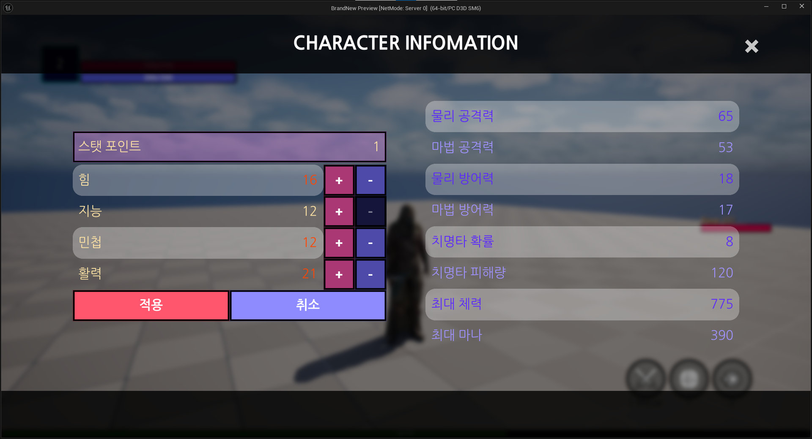

클라이언트가 강화할 Attribute를 뜻하는 Gameplay Tag와 Value를 서버에 보내면 서버는 유효한 요청인지 확인하고 GE를 통해 Attribute를 강화합니다.

```c++
// FAttributeUpgradePrams는 강화할 Attribute Tag와 Value를 저장하는 구조체입니다.
for (const FAttributeUpgradePrams& UpgradePrams : AttributeUpgradePrams)
{
    if (!UpgradePrams.TagToUpgrade.IsValid()) continue;

    ConsumedStatPoint += UpgradePrams.UpgradeAmount;
}

// GetAttributeValueByTag는 Gameplay Tag를 통해 Attribute의 Value를 가져오는 함수입니다.
if (GetAttributeValueByTag(/* StatPointTag */) < ConsumedStatPoint) return;
```

위 코드는 서버에서 Attribute를 강화하는 로직 중 일부로 소비된 스탯 포인트`ConsumedStatPoint`가 플레이어가 가진 포인트를 초과하는지 검증하는 과정을 보여줍니다.

> **GitHub Link**
> - Widget Controller → [캐릭터 클래스에 강화 수치 전달 (.cpp)](https://github.com/jinjinchoi/BrandnewGame/blob/main/Source/UIModule/Private/WidgetController/CharacterInfoWidgetController.cpp#L19)
> - Character Class → [실제 스탯 강화 로직 (.cpp)](https://github.com/jinjinchoi/BrandnewGame/blob/main/Source/CharacterModule/Private/Character/BrandNewPlayerCharacter.cpp#L440)

<br>

#### 3) Ability

데이터 에셋에서 부여할 어빌리티를 설정하고 게임 시작 후 데이터 에셋을 순회하여 어빌리티를 부여합니다.

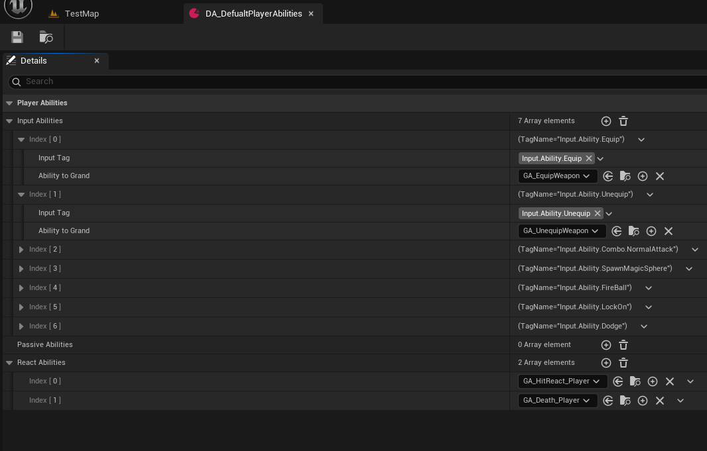

Active 어빌리티는 Gameplay Tag와 매핑하였으며 이 Tag는 Input Action과 매핑되어 있어 키보드 입력 시 해당하는 어빌리티가 발동됩니다.

<br>

#### 4) Ability 소개

구체적인 어빌리티 소개는 별도의 문서에서 다루었습니다.

> - [Ability 소개 문서](https://github.com/jinjinchoi/BrandnewGame/blob/main/AbilitySystemOverview.md)
---

### 2. Enemy

#### 1) Enemy Spawn

Enemy는 Object Pool에 저장하고 있다가 Spawn Volume에 플레이어가 접근하면 Pool에서 가져와 생성합니다. 이때 단순히 생성하기만 하는 것이 아니라 스폰할 장소의 유효성 등을 체크하여 Enemy를 Spawn할 수 있도록 하였습니다.

> **GitHub Link**
> - [Enemy Spawn Volme.h](https://github.com/jinjinchoi/BrandnewGame/blob/main/Source/CharacterModule/Public/Actor/Spawn/SpawnVolume.h)
> - [Enemy Spawn Volme.cpp](https://github.com/jinjinchoi/BrandnewGame/blob/main/Source/CharacterModule/Private/Actor/Spawn/SpawnVolume.cpp)

<br>

#### 2) Enemy Attribute 설정

서버에서 에너미를 소환할 때 레벨을 설정하며 데이터 테이블에 에너미의 레벨에 따른 Attribute를 설정하고 이 데이터 테이블에서 값을 가져와 에너미의 Attribute를 설정합니다.

```c++
FSecondaryAttributeDataRow* ABrandNewEnemyCharacter::FindEnemyDataRow() const
{
	if (!SecondaryAttributeDataTable) return nullptr;

	const FName RowName = *FString::Printf(TEXT("%s_Lv%d"), *EnemyName.ToString(), EnemyLevel);
	return SecondaryAttributeDataTable->FindRow<...>(RowName, TEXT("EnemyData Lookup"));
}
```

위의 코드는 데이터 테이블에서 에너미의 Attribute를 가져오는 함수로 데이터 테이블의 로우 네임은 `EnemyName_Lv1`과 같은 방식으로 설정되어 있습니다.

데이터 테이블을 사용한 이유는 디자이너가 에너미의 Attribute를 레벨별로 설정하기 쉽게 하기 위함이었는데 현재는 에너미의 종류 및 레벨 상한이 낮아 이 방식이 유효하지만 프로젝트가 커지면 커브 테이블과 같은 다른 방식을 사용하는 것이 더 적합하다고 판단하고 있습니다.

<br>

#### 3) Enemy Ability 설정

에너미의 Ability는 플레이어와 동일하게 데이터 에셋을 이용해 설정합니다.

<br>

#### 4) Enemy Ability 발동

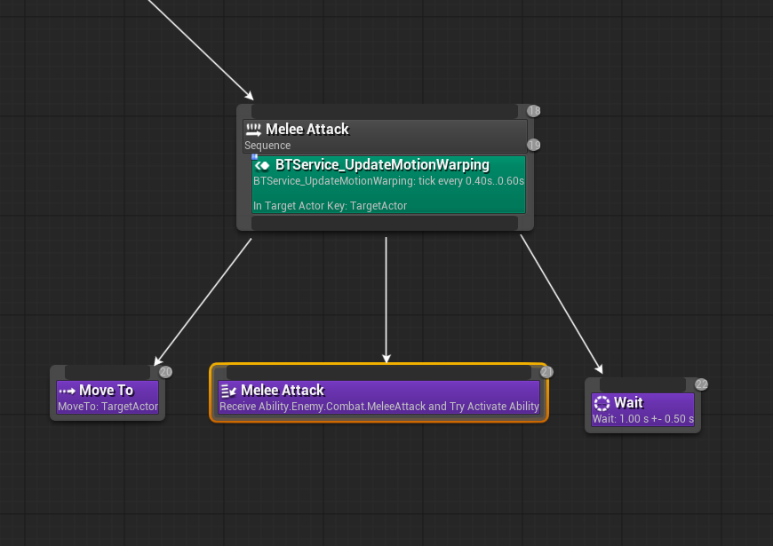

에너미의 어빌리티는 Behavior Tree에서 커스텀 Task를 통해 발동됩니다.

커스텀 Task를 만든 이유는 단순히 Gameplay Tag를 통해 에너미의 어빌리티를 발동시키는 것은 쉽지만 어빌리티가 종료하는 타이밍을 알아내기는 힘들어 커스텀 태스크를 사용하여 타이밍을 정확히 제어하기로 하였습니다.

```c++
struct FActiveAbilityByTagTaskMemory
```

위의 구조체는 커스텀 태스크 클래스에서 사용하는 메모리 구조체로 어빌리티의 경우 Cancel이나 Interrupt 되는 경우도 있기 때문에 `Ability Spec Handle`과 종료 시 호출되는 `Delegate Handle`을 저장하여 이에 대응할 수 있도록 하였습니다.

```c++
// 게임플레이 태그를 통해 어빌리티 스펙 핸들을 찾는 커스텀 함수 사용
const FGameplayAbilitySpecHandle SpecHandle = ASC->FindAbilitySpecHandleFromAbilityTag(AbilityTag);
if (!SpecHandle.IsValid())
{
    return EBTNodeResult::Failed;
}

// 스펙핸들을 통해 어빌리티 실행
if (ASC->TryActivateAbility(SpecHandle))
{
    TWeakObjectPtr WeakThis(this);
    TWeakObjectPtr WeakComp(&OwnerComp);
    
    // 메모리에 실행중인 어빌리티 스펙 핸들 저장
    Memory->ActivatedAbilitySpecHandle = SpecHandle;
    
    // OnAbilityEnded 바인딩하고 델리게이트 핸들 저장
    Memory->OnAbilityEndedDelegateHandle = ASC->OnAbilityEnded.AddLambda([...](...)
    {
        // ... (유효성 확인 부분 생략)
        
        // Ability 종료 시 Task 종료
        WeakThis->FinishLatentTask(
            *WeakComp, Data.bWasCancelled ? EBTNodeResult::Failed : EBTNodeResult::Succeeded);
     
    });
    
    // Ability 종료 전까지 Progress 상태로 둠
    return EBTNodeResult::InProgress;
}
```

위의 로직은 태스크에서 어빌리티를 실행시키고 어빌리티 종료 시 태스크도 종료시키는 로직 중 일부입니다. `OnAbilityEnded`에 바인딩할 때 Weak Ptr을 사용하여 에너미가 제거될 수 있는 상황에도 대응하였습니다.

```c++
// Task 진행 방해 받을 시 Memory 초기화 작업
EBTNodeResult::Type UBTTask_ActiveAbilityByTag::AbortTask(...)
{
	if (Memory)
	{
		Memory->ASC->CancelAbilityHandle(Memory->ActivatedAbilitySpecHandle);
		Memory->ASC->OnAbilityEnded.Remove(Memory->OnAbilityEndedDelegateHandle);
		Memory->Reset();
	}
	
	return Super::AbortTask(...);
}
```
Task가 방해받을 경우 메모리에서 Spec Handle과 Delegate Handle을 가져와 어빌리티를 취소시키고 델리게이트의 바인딩을 제거합니다.

<br>

> **GitHub Link**
> - [UBTTask_ActiveAbilityByTag.h](https://github.com/jinjinchoi/BrandnewGame/blob/main/Source/CharacterModule/Public/AI/BTTask_ActiveAbilityByTag.h)
> - [UBTTask_ActiveAbilityByTag.cpp](https://github.com/jinjinchoi/BrandnewGame/blob/main/Source/CharacterModule/Private/AI/BTTask_ActiveAbilityByTag.cpp)

---

### 3. Inventory / Item

#### 1) 인벤토리 구조

인벤토리 구조는 **Inventory → Slot → Item** 형태로 구성되어 있습니다.

```text
Inventory (UBrandNewInventoryComponent)
│
├─ ItemInventory (FInventoryContents)
│   ├─ WeaponSlots    : TArray<FInventorySlotData>
│   ├─ ArmorSlots     : TArray<FInventorySlotData>
│   └─ EatablesSlots  : TArray<FInventorySlotData>
│
│   각 SlotData
│       └─ Item : FInventorySlotData
│
└─ Functions : AddItem / EquipItem / ConsumeItem / Getter / Setter
```

인벤토리 역할을 하는 `ItemInventory`구조체는 복제 설정을 하였으며 인벤토리와 관련된 모든 로직은 서버에서만 담당하도록 하였습니다. 

<br>

> **GitHub Link**
> - [InventoryComponent.h](https://github.com/jinjinchoi/BrandnewGame/blob/main/Source/InventoryModule/Public/Inventory/BrandNewInventory.h)
> - [InventoryComponent.cpp](https://github.com/jinjinchoi/BrandnewGame/blob/main/Source/InventoryModule/Private/Inventory/BrandNewInventory.cpp)

<br>

#### 2) 아이템

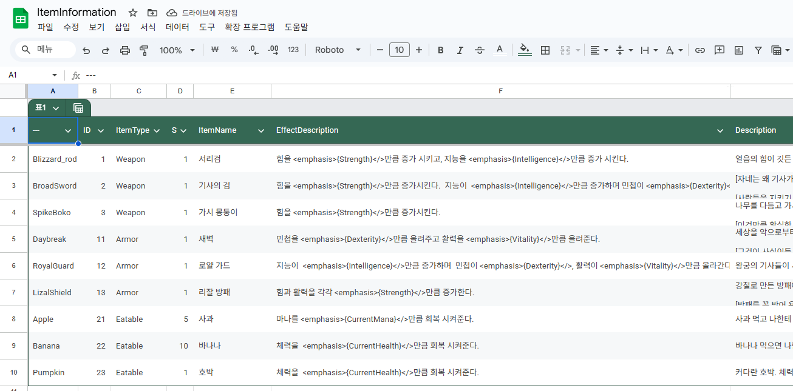

각각의 아이템들은 Id를 통해 관리되며 데이터 테이블에서 정보를 가져와 UI에 보여주거나 효과를 적용합니다.

<br>

#### 3) 아이템 획득

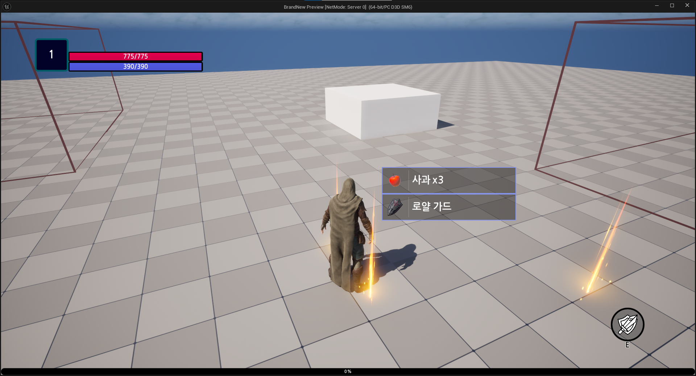

아이템과 오버랩 시 아이템 클래스는 플레이어에게 자신의 정보를 보냅니다.

```c++
// 아이템 클래스가 호출하는 플레이어 캐릭터의 함수 (인터페이스로 상속 받아 구현)
void ABrandNewPlayerCharacter::AddOverlappedItem(AActor* OverlappedItem)
{
	if (HasAuthority() || IsLocallyControlled())
	{
		OverlappedItems.Add(OverlappedItem);
	}

	if (IsLocallyControlled())
	{
		SendPickupInfoToUi(OverlappedItem, true);
	}
}
```
아이템 클래스를 수신받으면 오버랩된 아이템 배열에 아이템 클래스를 저장합니다. 이때 클라이언트의 Simulated Proxy는 아이템 획득 로직과 관련이 없어 제외하였습니다.

클라이언트가 아이템 획득 키를 누르면 `OverlappedItems`에 아이템이 있는지 먼저 확인합니다. 아이템이 존재하면 RPC를 보내고 서버에서 아이템을 획득하는 작업을 합니다.

서버는 서버의 `OverlappedItems` 배열을 사용하고 클라이언트는 클라이언트의 `OverlappedItems` 배열을 사용하여 클라이언트가 임의로 아이템을 획득하는 상황을 방지했습니다.

<br>

#### 4) 아이템 장착 및 사용
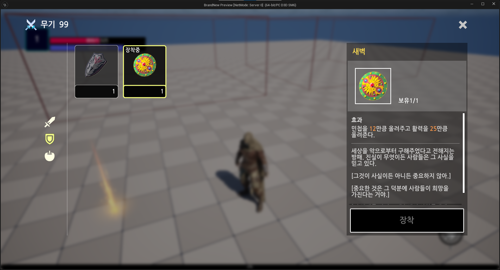
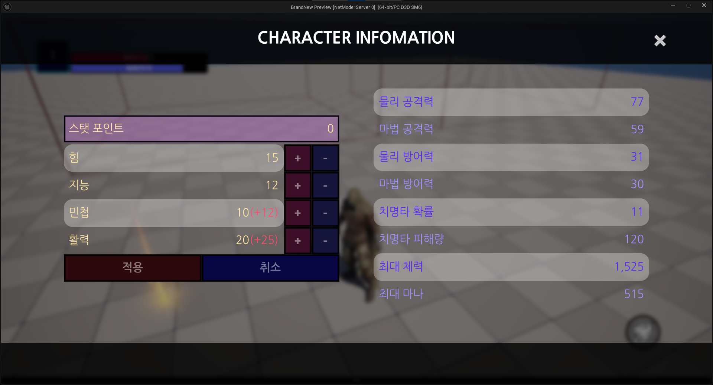

아이템을 장착하면 Infinite Gameplay Effect를 주어 Effect Handle을 저장하고 장비 변경 시 Effect를 제거하여 새롭게 GE를 부여할 수 있게 하였습니다.

```c++
// 아이템용 Attribute 예시
UPROPERTY(...)
FGameplayAttributeData ItemStrength;
ATTRIBUTE_ACCESSORS(...);
```

아이템은 직접 Attribute를 올리는 것이 아니라 아이템 전용 Attribute에 효과를 주어 세이브/로드 시 순수한 캐릭터의 Attribute만 저장하고 UI에도 보여주기 쉽게 구현하였습니다.

소비 아이템은 Instance 효과를 주었으며 스택을 감소시키거나 배열에서 제외하는 방식으로 소모하도록 구현하였습니다.

---

### 4. Object Pooling
오브젝트 풀링을 사용하여 액터들을 미리 생성하고 필요시 꺼내어 사용할 수 있도록 하였습니다. 게임이 시작되면 액터들을 미리 생성하고 Hidden으로 설정한 뒤 Pool에 저장해놓았다가 필요시 배열에서 액터들을 꺼내 오는 방식으로 작동합니다.

최적화를 위하여 Level마다 풀에 저장할 액터들을 설정할 수 있게 하였고, 풀에 최초로 액터를 생성할 때 타이머를 사용하여 한 프레임에 최대 소환할 수 있는 액터의 수를 제한하여 지연 발생을 최대한 줄였습니다.

<br>

> **GitHub Link**
> - [Object Pool.h](https://github.com/jinjinchoi/BrandnewGame/blob/main/Source/CoreModule/Public/Manager/Pooling/BrandNewObjectPoolManager.h)
> - [Object Pool.cpp](https://github.com/jinjinchoi/BrandnewGame/blob/main/Source/CoreModule/Private/Manager/Pooling/BrandNewObjectPoolManager.cpp)

---

### 5. Save And Load

#### 1) Indentity

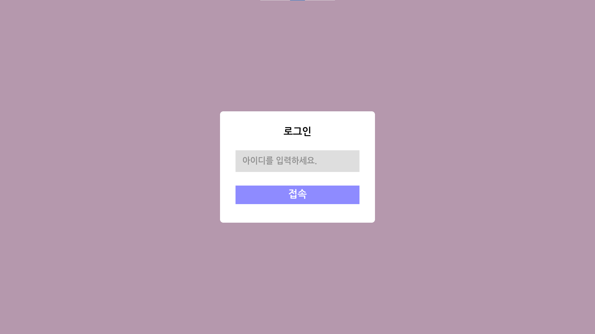

클라이언트가 접속 시 아이디를 입력하고 클라이언트의 서브시스템에 저장합니다.

아이디 기능을 따로 만든 이유는 클라이언트 간에 데이터를 따로 저장하고 싶었고 엔진에서 제공해 주는 기능들이 있기는 하지만 직접 RPC나 복제 기능을 사용하여 ID를 구분하고 싶었기 때문입니다.

```c++
SaveSubsystem = GetGameInstance()->GetSubsystem<...>();
Server_RequestInitCharacterInfo(SaveSubsystem->GetUniqueIdentifier());
```

클라이언트가 접속하면 RPC를 통해 서버에 자신의 아이디를 보내는데 서버는 클라이언트의 서브시스템에 직접 접근할 수 없어 RPC를 사용하였습니다.

서버는 클라이언트가 보낸 아이디를 Player State에 저장하고 이는 다시 클라이언트로 복제가 되어 클라이언트가 다른 클라이언트의 아이디를 알 수 있게 하였습니다.

<br>

#### 2) Save

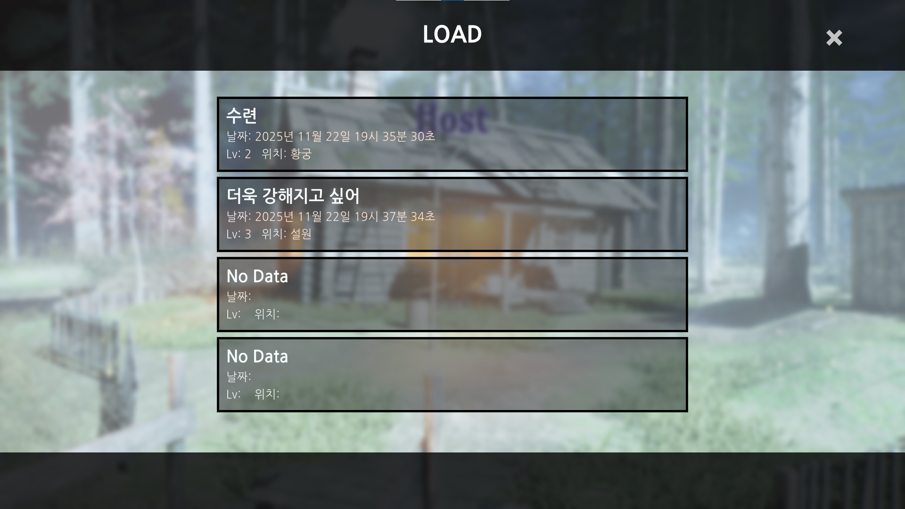

세이브 요청은 호스트만 할 수 있습니다. 멀티플레이 게임인데도 수동 세이브에 슬롯으로 세이브 데이터를 구분한 이유는 순전히 포트폴리오로서의 목적이 강하기는 하지만 호스트에게 월드를 관리할 권한이 있다는 의미를 부여하기 위한 목적으로도 구현하였습니다.

```c++
for (const TObjectPtr<APlayerState>& PlayerState : GameState->PlayerArray)
{
    if (!PlayerState) continue;
    
    APawn* Pawn = PlayerState->GetPawn();
    if (IBrandNewPlayerInterface* PlayerInterface = Cast<...>(Pawn))
    {
        PlayerInterface->RequestSave(SlotName, SlotIndex);
    }
}
```

호스트가 세이브 요청을 하면 Game State에서 Player State 배열을 가져와 모든 플레이어의 데이터를 저장합니다.

<br>

#### 3) Load

플레이어가 접속할 때 위의 아이디를 저장했던 함수인 `Server_RequestInitCharacterInfo()`에서 로드 작업을 진행합니다.

호스트는 NewGame 또는 Load로 월드에 진입하게 되는데 Load를 할 경우 호스트의 서브시스템에는 어느 슬롯을 사용하여 로드를 했는지를 저장합니다.

```c++
// 호스트가 사용한 로드 슬롯과 동일한 슬롯의 데이터를 가져와 데이터가 존재하면 로드 진행
if (SaveSubsystem->IsLoadedWorld() && SaveSubsystem->GetCurrentSlotSaveDataById(UniqueId).bIsValid)
{
    const FSaveSlotPrams SavedData = SaveSubsystem->GetCurrentSlotSaveDataById(UniqueId);
    LoadCharacterData(SavedData);
    return;
}
```

세이브 데이터는 **슬롯 아이디 + 플레이어 아이디**로 저장되어 있으며 호스트가 사용한 슬롯 아이디와 클라이언트의 아이디를 조합하여 슬롯마다 각각 다른 데이터를 클라이언트도 로드하게 됩니다.

---

### 6. Map Travel

#### 1) Map Entrace Actor

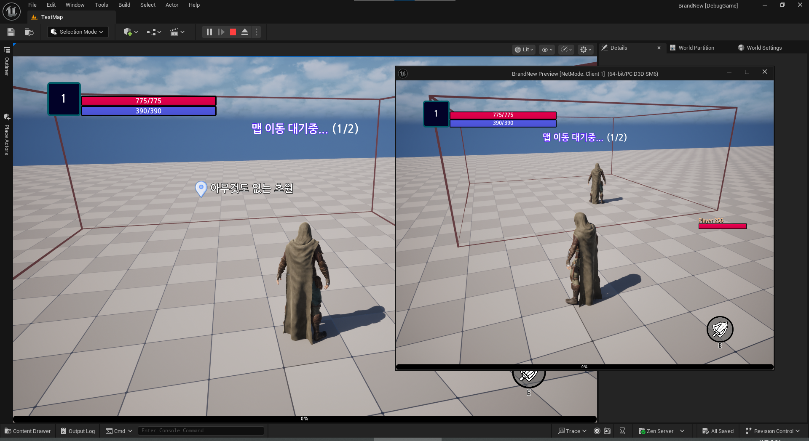

Map Entrace Actor는 모든 플레이어가 오버랩 되면 다음 지역으로 이동시키는 액터입니다.

```c++
if (OverlappingActors.Num() == GameState->PlayerArray.Num())
```

오버랩 된 플레이어를 배열에 보관하고 그 수가 전체 플레이어 수와 동일하면 Server Travel을 통해 맵을 이동시킵니다.

플레이어는 언제든 게임에 참여하고 나갈 수 있기 때문에 Game State에서 플레이어가 접속하거나 종료할 때 델리게이트를 브로드캐스트 하게 하였고 Map Entrace에서 이를 구독하여 오버랩 중인 플레이어를 다시 계산하도록 하였습니다.

> **GitHub Link**
> - [Map Entrace Actor.h](https://github.com/jinjinchoi/BrandnewGame/blob/main/Source/CharacterModule/Public/Actor/Map/MapEntrance.h)
> - [Map Entrace Actor.cpp](https://github.com/jinjinchoi/BrandnewGame/blob/main/Source/CharacterModule/Private/Actor/Map/MapEntrance.cpp)

<br>

#### 2) Map Travel 시 데이터 저장

Map을 이동할 때 디스크에 데이터를 저장하는 것이 아닌 서버의 서브시스템에 데이터를 저장하도록 하였습니다.

```c++
TMap<FString, FSaveSlotPrams> LatestPlayerDataMap;
```

클라이언트 아이디와 세이브 데이터를 저장하며 캐릭터 클래스가 다시 생성될 때 맵 이동 여부를 확인하고 데이터를 로드하게 됩니다.

---

### 7. Dialogue System

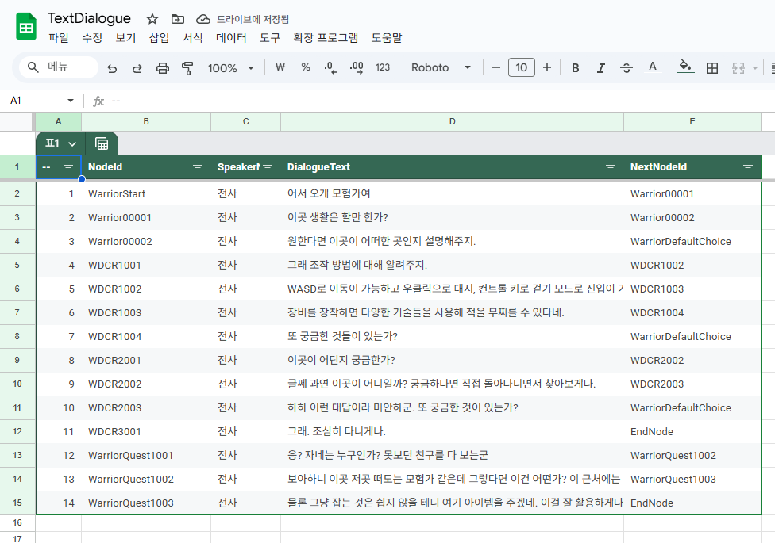
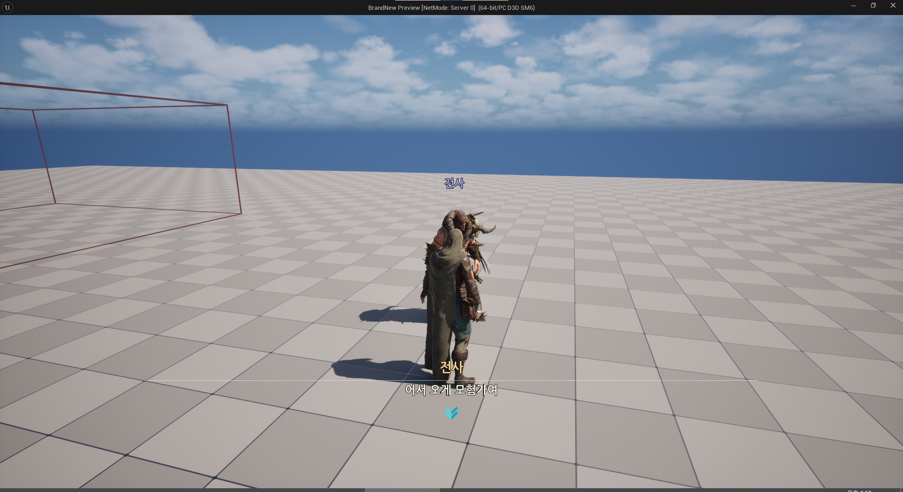

#### 1) Dialogue System 구조

다이얼로그 시스템은 노드 기반으로 제작되어 다이얼로그 아이디를 통해 데이터를 가져오고 다음 노드로 연결하는 작업을 합니다.

데이터 테이블로 다이얼로그 노드들을 제작하여 디자이너 친화적으로 구현할 수 있게 하였습니다.

```text
DialogueManager
 └── DialogueGraph
       ├── DialogueNode (일반 대사)
       ├── ChoiceNode (선택지)
       └── SequenceNode (시퀀스/컷신)
```

다이얼로그 시스템의 구조는 위와 같으며 전체 노드는 그래프 클래스에서 보관하고 매니저 클래스는 이 그래프 클래스에서 특정 노드를 가져오는 작업을 합니다.

<br>

#### 2) Dialogue Widget Controller

다이얼로그 위젯 컨트롤러는 다이얼로그를 실행할 때 위젯에서 사용하는 컨트롤러로 실제 대화 로직 대부분을 담당하는 클래스입니다.

```c++
void ABrandNewHUD::CreateDialogueWidget(const FName& FirstDialogueId)
```

HUD 클래스는 위의 함수를 통해 다이얼로그를 실행할 때 위의 함수에서 위젯과 위젯 컨트롤러 모두 생성합니다.

```c++
// 위젯 컨트롤러에서 다이얼로그를 관리하는 함수 중 일부
switch (DialogueSubSystem->GetDialogueTypeById(DialogueId))
{
    // ... 다이얼로그 타입별 로직 실행
}
```

위젯 컨트롤러는 DialogueId를 받으면 그 다이얼로그가 어떤 타입의 다이얼로그인지 확인하고 그에 맞는 로직들을 실행합니다.

---

### 8. Quest

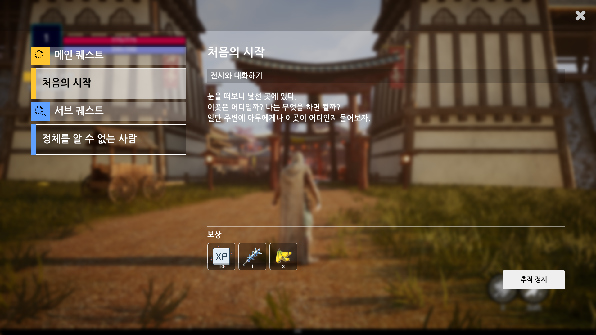

퀘스트의 UI나 진행 방식은 `붕괴: 스타레일`에서 일정 부분을 참고하였습니다. 퀘스트는 UI에 보여주는 부분을 제외하고 전부 서버에서 관리됩니다.

#### 1) 퀘스트 부여

퀘스트도 다이얼로그와 유사하게 데이터 테이블에서 제작되며 ID를 통해 관리됩니다.

```c++
for (int32 i = 1; i <= PlayerLevel; ++i)
{
    if (!LevelToQuestsMap.Contains(PlayerLevel)) continue;

    for (const FQuestObjectiveBase QuestObjective : LevelToQuestsMap[i])
    {
        if (QuestObjective.MinLevel <= 0) continue;
        AddActivatedQuest(QuestObjective);
    }
}
```

퀘스트 컴포넌트는 게임 시작 시 `LevelToQuestsMap`에 레벨별 퀘스트를 저장하고 플레이어의 레벨을 받으면 활성화 가능한 퀘스트들을 활성화합니다.

<br>

#### 2) 퀘스트 진행

퀘스트 액터들은 조건에 따라 플레이어에게 자신의 아이디를 넘깁니다.

```c++
/* 퀘스트의 목표가 되는 아이디 */
UPROPERTY(...)
FName TargetId = NAME_None;
```
퀘스트의 목표에는 위와 같이 타겟 아이디가 지정되어 있으며 동일한 아이디가 들어오면 카운트를 올려 퀘스트를 진행합니다.

```c++
// 캐릭터 클래스에서 진행도를 올리는 로직 중 일부.
for (const FQuestInstance& Quest : QuestComponent->GetActivatedQuests())
{
    if (Quest.TargetId == TargetId)
    {
        QuestComponent->IncreaseQuestProgress(Quest.QuestId);
    }
}
```

<br>

#### 3) 퀘스트 추적

```c++
if (UBrandnewQuestSubsystem* QuestSubsystem = GetGameInstance()->GetSubsystem<...>())
{
    QuestSubsystem->AddQuestActorToMap(ActorId, this);
}
```

퀘스트 대상이 되는 액터들은 서브시스템의 자신의 정보를 알리고 저장합니다.

```c++
AActor* TargetActor = QuestSubsystem->GetQuestTargetById(TargetId);

if (IQuestActorInterface* QuestActorInterface = Cast<...>(TargetActor))
{
    QuestActorInterface->ShowLocationWidget(true);
}
```

퀘스트 추적이 시작되면 서브시스템으로 부터 아이디를 통해 액터를 가져와 Widget Component의 Visibility를 지정하여 플레이어의 화면에 위치를 보여줍니다.

<br>

#### 4) 퀘스트 로드 시 추적

퀘스트 저장은 퀘스트의 아이디와 진행도만 저장하여 로드하는 방식을 취하기 때문에 로직을 매우 간단하게 구현할 수 있었습니다.

한 가지 번거로웠던 작업은 추적 중인 퀘스트 액터의 위치를 표시하는 작업이었는데 추적 중인 퀘스트 로드가 액터가 서브시스템에 등록하는 시간보다 빠르면 액터를 제대로 찾아올 수 없다는 점이었습니다.

```c++
if (QuestActorMap.Contains(ActorId)) {...}
else { PendingActorId = ActorId; }
```

이를 해결하기 위해 우선 액터 저장보다 액터를 요청하는 함수가 먼저 실행될 경우 해당 액터의 아이디를 저장하였습니다.

```c++
if (PendingActorId != NAME_None && PendingActorId == ActorId)
{
    OnQuestActorSetDelegate.Broadcast();
    PendingActorId = NAME_None;
}
```

그 후 액터를 추가하는 함수에서 추적을 기다리고 있던 액터의 데이터를 받으면 델리게이트를 통해 이를 브로드캐스트 하고 퀘스트 컴포넌트는 이를 수신하여 다시 액터를 찾는 작업을 하도록 하여 정상적으로 추적이 이루어지게 하였습니다.

---

## 05. 문제 해결 및 방법

포트폴리오 제작 중 다양한 문제에 직면했지만 가장 자주 발생했던 문제는 멀티플레이와 관련된 부분이었습니다.

이 중 대부분의 문제점은 프록시에 대해 제대로 인지하지 못한 상태에서 발생하였는데 대표적인 문제로 다른 클라이언트의 정보를 UI에 표현할 때 발생한 문제가 있습니다.

로컬 클라이언트가 캐릭터가 복제되면 RPC를 사용해 서버의 Game State에 캐릭터 정보를 저장하고 이를 복제하였는데 Simulated Proxy가 클라이언트에게 존재한다는 것을 인식하지 못한 채 한 실수였고 그로 인해 시연 영상에서 나오는 것 같이 네트워크 환경이 불안정하면 UI에 다른 플레이어의 정보가 안나오는 버그가 생겼습니다.

클라이언트는 모든 다른 클라이언트의 캐릭터 복제본을 받기 때문에 자신의 게임 스테이트에 그냥 복제본의 데이터를 저장하면 되는 작업이었습니다.

영상 촬영 시점과 지금 MD 파일을 작성하는 시점이 그렇게 많이 차이 나지는 않지만 그 사이에도 프록시들에 대해 더욱 자세히 알게 되었고 덕분에 MD 파일을 작성하면서도 잘못된 RPC 사용이나 과도한 RPC 사용을 수정할 수 있게 되었습니다.

---

## 06. 고찰 및 회고

언리얼 멀티플레이 로직에 대해 더욱 자세히 알 수 있게 된 프로젝트였습니다.

가능하면 데디케이트 서버 환경에서 프로젝트를 제작하고 싶었는데 그렇게 하지 못한 점은 조금 아쉽지만 그래도 충분히 RPC나 Replication에 대해 알 수 있었습니다.

엔진에서 생각이상으로 멀티플레이에 도움을 주는 기능들을 많이 제공해 준다는 것을 알았고 그런 기능들이 있는지 모르고 시작해 불필요한 부분을 만든 경우도 있었지만 오히려 그러한 경험 덕분에 멀티플레이 로직에 대해 더 자세히 알 수 있게 되었습니다.