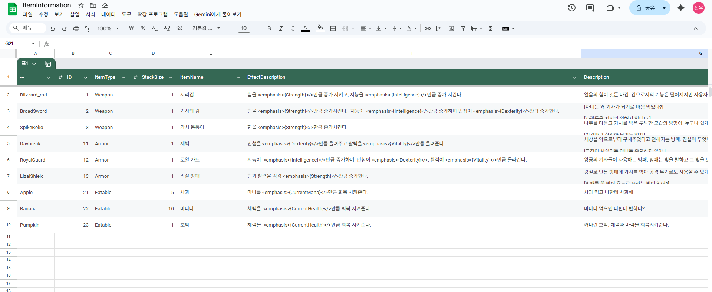

## 01. 목차

---
## 02. 개요
- **프로젝트소개**
    - 리슨 서버 기반 멀티플레이 RPG 게임
- **개발인원**
  - 1명
- **사용엔진**
  - 언리얼 엔진 5.6.1
- **작업 기간**
  - 2025년 8월 21일 ~
---
## 03. 프로젝트 요약
- **장르**
  - 3D Action RPG Game


- **게임특징**
  - 리슨 서버를 통한 멀티플레이를 구현하였으며 서버와 클라이언트의 역할을 분리하여 최대한 데디케이트 서버 환경과 유사한 구조로 설계하였습니다.
  - Gameplay Ability System 프레임워크를 이용하여 일반적인 온라인 RPC 게임처럼 몬스터를 잡고 레벨을 올리며 능력치를 강화하고 아이템을 장착하는 등의 기능을 구현하였습니다.
  

- **주요기능 요약**
    - **캐릭터 성장 시스템**  
    `Gameplay Ability System`을 이용하여 **Attribute**를 구현하였으며 몬스터를 처치시 경험치를 획득하여 Attribute를 강화하고 아이템을 장착하여 캐릭터가 더 강해지도록 제작하였습니다.
    - **멀티플레이**  
  리슨서버를 사용하여 멀티플레이를 구현하였으며 **Replication**을 통하여 클라이언트에서도 정상적으로 Actor가 복제되게 설정하였고 RPC를 통하여 서버와 클라이언트간에 데이터를 주고 받아 둘의 역할을 분리시켰습니다. 
    - **저장 및 불러오기**  
  캐릭터의 Attribute나 Map 위치, 인벤토리등을 호스트(서버)의 디스크에 기록하며 `클라이언트에서도 데이터를 저장`하고 가져올 수 있게 매우 간단한 로그인 시스템을 구현하였습니다.
    - **Object Pooling System**  
    `오브젝트 풀`을 사용하여 Projectile이나 Emeny와 같이 자주 소환되는 Actor들은 Object Pool에 저장하였다가 필요시 꺼내 사용하여 성능을 최적화 하였습니다.
  - **모듈화**  
    각각의 기능들을 독립적으로 모듈화하여 Core 모듈을 제외하고는 각각의 모듈들은 서로 의존성이 없어 독립적으로 개발이 가능합니다.
  - **다이얼로그 시스템**  
  노드 기반의 다이얼로그 시스템을 구현하여 다양한 분기의 대화를 쉽게 처리할 수 있도록 하였습니다.
---
## 04. 핵심 기능 및 구현 내용
### 04.1 Gameplay Ability System
GAS를 사용하여 Attribute와 Ability 기능을 구현하였으며 Attribute의 경우 Primary Attribute를 기반으로 Secondary Attribute를 설정하여 과거 주류 RPC 게임처럼 스탯을 올려 캐릭터를 강화시킬 수 있도록 구현하였습니다.

- **Attribute 및 Ability 적용**  
Attribute는 Gameplay Effect를 통해 적용되며 최초의 기본 Attribute는 데이터 테이블에서 설정하게 하여 디자이너가 간편하게 초기 Attribute를 설정할 수 있게 하였습니다.<br>   
Abilty는 Data Asset에서 설정되는데 이중 Active어빌리티는 Input Tag와 연결하였으며 또 이 Input Tag는 Input Action과 연결되어 키보드 바인딩이 변경될 일이 있어도 어빌리티 로직 수정 없이 Input Action만 바꾸면 되게 구현하였습니다.

> Github Link 
> 
> - [어빌리티 정보가 저장된 Data Asset Class](https://github.com/jinjinchoi/BrandnewGame/blob/main/Source/CoreModule/Public/DataAssets/DataAsset_DefaultPlayerAbilities.h)

- **능력치 강화**


캐릭터 인포메이션에 있는 각각의 위젯에는 Gameplay Tag와 FGameplayAttribute 구조체가 연결되어 있어 Gameplay Tag만 지정하면 Attribute 값을 가져올 수 있게 설정하였습니다.<br>

스탯 포인트가 0 이상일 경우 강화 버튼이 활성화 되며 +버튼이나 -버튼을 누르면 TMap에 Gameplay Tag와 float 값을 저장하고 서버에 보내 Attribute를 강화할 수 있도록 구현하였습니다.

```c++
// Widget Controller Class

// 위젯에서 위젯 컨트롤러에 강화할 Attribute의 정보가 담긴 TMap을 보냄. 
void UCharacterInfoWidgetController::UpgradeAttribute(const TMap<FGameplayTag, float>& AttributeUpgradeMap)
{
    
	IBrandNewPlayerInterface* PlayerInterface = Cast<IBrandNewPlayerInterface>(ControlledPawn);
	if (!PlayerInterface) return;

	TArray<FAttributeUpgradePrams> UpgradePrams;
	for (const TPair<FGameplayTag, float>& UpgradeData : AttributeUpgradeMap)
	{
		if (!UpgradeData.Key.IsValid()) continue;
		FAttributeUpgradePrams UpgradePram(UpgradeData.Key, UpgradeData.Value); // TMap을 구조체로 변환

		UpgradePrams.Add(UpgradePram);
		
	}

	PlayerInterface->UpgradeAttribute(UpgradePrams); // 캐릭터 클래스에 데이터 전송
	
}
	
// Character Class
void ABrandNewPlayerCharacter::UpgradeAttribute(const TArray<FAttributeUpgradePrams>& AttributeUpgradePrams)
{
	// ... null check 생략
	
	Server_RequestUpgradeAttribute(AttributeUpgradePrams); // 서버 RPC로 Attribute 강화 요청.
	
}

void ABrandNewPlayerCharacter::Server_RequestUpgradeAttribute_Implementation(const TArray<FAttributeUpgradePrams>& AttributeUpgradePrams)
{
	// ... Effect Context 및 Spect Handle 생성 부분 생략

	int32 ConsumedStatPoint = 0;
	
	for (const FAttributeUpgradePrams& UpgradePrams : AttributeUpgradePrams)
	{
		if (!UpgradePrams.TagToUpgrade.IsValid()) continue;

		ConsumedStatPoint += UpgradePrams.UpgradeAmount;
		// Set by Caller를 사용해 강화 수치 설정
		UAbilitySystemBlueprintLibrary::AssignTagSetByCallerMagnitude(SpecHandle,UpgradePrams.TagToUpgrade, UpgradePrams.UpgradeAmount);
	}
	
	// 유효한 강화 시도인지 확인
	if (GetAttributeValueByTag(BrandNewGamePlayTag::Attribute_Experience_AttributePoint) < ConsumedStatPoint) return;
	
	//  ... 실제 Effect 적용 부분 생략
	
}
```
위젯 컨트롤러에서 플레이어 캐릭터로 강화 정보를 보내는 로직입니다.<br>  
RPC로는 TMap을 바로 보낼 수 없기 때문에 구조체로 변환하여 서버로 데이터를 보냅니다. 서버에서는 강화를 하기 전 Stat Point를 확인하여 부정한 Attribute 강화를 차단하고 Gameplay Effect를 통해 Attribute를 강화합니다.

### 04.2 Inventory System
인벤토리 클래스는 Player State에 저장되어 있습니다. 
- **Iten Info Data Table**  



아이템 정보를 데이터 테이블에 저장하여 디자이너가 쉽게 아이템 정보를 설정할 수 있게 하였고 아이템은 Id만 설정하여 이 Id를 통해 데이터 테이블에서 정보를 가져오도록 구현하였습니다.

- **Item 획득**

 

아이템은 몬스터 처치시 일정확률로 스폰되며 이 아이템에 오버랩되면 Id를 통해 아이템 정보를 가져오고 Interaction 키(F)를 눌러 아이템을 획득 할 수 있습니다.
```c++
void ABrandNewPlayerCharacter::AddOverlappedItem(AActor* OverlappedItem)
{
	if (HasAuthority())
	{
		OverlappedItems.Add(OverlappedItem); // 서버에서 실제 오버랩된 아이템된 아이템
	}
	else
	{
		OverlappedItemsForUI.Add(OverlappedItem); // 클라이언트 UI 표시용 오버랩된 아이템
	}
	SendPickupInfoToUi(OverlappedItem, true);
	
}
```
아이템과 오버랩시 호출되는 함수입니다. 서버와 클라이언트간에 아이템을 저장하는 Array가 다른데 아이템 습득시 클라이언트로부터 정보를 받는 것이 아니라 오직 서버에만 존재하는 오버랩된 아이템 정보를 가지고 아이템 획득 작업을 진행하여 부정한 아이템 획득을 방지하였습니다.  

다만 클라이언트도 화면에 보여주고 제거할때 오버랩 된 아이템들이 어떤 것인지 알아야하기 때문에 클라이언트 전용 배열에는 저장하였으며 이때 RPC를 사용하지 않은 이유는 단순히 화면에만 보여주는 것이 목적이기 때문에 굳이 RPC를 사용하여 네트워크 트래픽을 증가시킬 필요가 없다고 판단하였기 때문입니다.

- **Inventory**  
인벤토리 클래스에서는 구조체로 아이템 정보를 저장하고 있습니다.
```c++
////// 구조체 정보//////

/* 인벤토리 슬롯 하나에 담겨 있는 아이템 정보 */
USTRUCT(BlueprintType)
struct FInventorySlotData
{
	GENERATED_BODY()

	/* 아이디를 저장하여 TMap에서 아이템 정보를 가져옴 */
	UPROPERTY(BlueprintReadOnly)
	int32 ItemID = INDEX_NONE;
	
	// 한 슬롯에 저장된 아이템의 수
	UPROPERTY(BlueprintReadOnly)
	int32 Quantity = 0;
	
	// 아이템 장착 여부
	UPROPERTY(BlueprintReadOnly)
	bool bIsEquipped = false;
	
};

/* 전체 인벤토리 */
USTRUCT(BlueprintType)
struct FInventoryContents
{
	GENERATED_BODY()

	UPROPERTY(BlueprintReadOnly)
	TArray<FInventorySlotData> WeaponSlots = TArray<FInventorySlotData>(); // 무기
	
	UPROPERTY(BlueprintReadOnly)
	TArray<FInventorySlotData> ArmorSlots = TArray<FInventorySlotData>(); // 방어구
	
	UPROPERTY(BlueprintReadOnly)
	TArray<FInventorySlotData> EatablesSlots = TArray<FInventorySlotData>(); // 소비
	
};

// Inventory Class에 저장되어있는 인벤토리 변수
UPROPERTY(Replicated)
FInventoryContents ItemInventory;
```
아이템 저장은 인벤토리 클래스에 Id와 Quantity를 넘기면 인벤토리 클래스에서 배열을 추가하는 방식으로 구현하였습니다.

- **아이템 장착 및 사용**  
소비 아이템의 경우 Instance Gameplay Effect를 주어 즉각적으로 체력등 Attribute에 영향을 줍니다.<br>  
장비 아이템의 경우 Infinite Gameplay Effect를 주고 Effect Handle을 저장하여 무기 변경시 Effect를 제거하고 새로 주는 방식으로 효과를 바꿔주었습니다. 또한 아이템 장착 여부를 인벤토리 클래스에 저장하여 세이브, 로드시에 장착중이였던 아이템을 알기 쉽게 알도록 구현하였습니다. 
> Github Link
> 
> - [아이템 소비 함수](https://github.com/jinjinchoi/BrandnewGame/blob/main/Source/CharacterModule/Private/Character/BrandNewPlayerCharacter.cpp#L914)  
> - [아이템 장착 함수](https://github.com/jinjinchoi/BrandnewGame/blob/main/Source/CharacterModule/Private/Character/BrandNewPlayerCharacter.cpp#L959)

### 04.3 Map Travel
- **Level Manager Subsystem**  
맵(Level) 이동을 관리하는 서브시스템입니다.
```c++
// Level Manager Subsystem
// 맵 이동 로직은 아래 함수들을 상황에 맞게 실행시키는 방식으로 진행됩니다.

// 맵 경로를 설정하는 함수 (본문 생략)
void UBrandNewLevelManagerSubsystem::SetMapNameToTravelByString();

// Transition Map으로 이동하는 함수 (본문 생략)
void UBrandNewLevelManagerSubsystem::TravelToTransitionMap();

// 맵 비동기 로드 시작
void UBrandNewLevelManagerSubsystem::StartAsyncLoading()
{
	// ... 생략
	
    LoadPackageAsync(
        TargetLevelPath.ToString(),
        FLoadPackageAsyncDelegate::CreateUObject(this, &UBrandNewLevelManagerSubsystem::OnLoadPackageCompleted),
        0,
        PKG_ContainsMap);

}

/**
* 맵 로딩 성공 여부 확인. 성공 여부를 각각의 클라이언트들이 서버에 전송하고
* 서버(호스트)는 모든 클라이언트가 맵 로드에 성공하면 맵을 이동할 수 있게 됩니다.
*/
void UBrandNewLevelManagerSubsystem::OnLoadPackageCompleted(const FName& PackageName, UPackage* LoadedPackage, EAsyncLoadingResult::Type Result)
{
	GetWorld()->GetTimerManager().ClearTimer(LoadingPercentTimerHandle);
	if (Result == EAsyncLoadingResult::Succeeded)
	{
		OnAsyncLoadingCompleteDelegate.Broadcast(true);
	}
	else
	{
		OnAsyncLoadingCompleteDelegate.Broadcast(false);
	}
}
```
> 전체 코드 Github Link  
> - [Level Manager Subsystem.h](https://github.com/jinjinchoi/BrandnewGame/blob/main/Source/CoreModule/Public/Game/Subsystem/BrandNewLevelManagerSubsystem.h)  
> - [Level Manager Subsystem.cpp](https://github.com/jinjinchoi/BrandnewGame/blob/main/Source/CoreModule/Private/Game/Subsystem/BrandNewLevelManagerSubsystem.cpp)

맵 이동 로직은 다음과 같습니다. 먼저 맵 이동전 이동할 맵 경로를 `TargetLevelPath` 변수에 설정합니다. 해당 변수를 설정한 뒤 트랜지션 맵으로 이동하고 이곳에서 비동기적으로 월드 에셋을 로드합니다. 바로 맵을 Open 하는 것이 아닌 비동기 로드를 하기 때문에 게임이 멈추는 시간을 최소화하며 사용자에게 로딩화면을 보여주어 더 나은 게임 환경을 느낄 수 있게 하였습니다.

리슨 서버를 사용하기 때문에 모든 플레이어가 함께 이동하는 것이 중요하고 그렇기 때문에 로딩이 완료될 때 클라이언트들은 서버에 이를 알립니다. 서버에서는 모든 플레이어의 로딩이 끝나면 맵을 이동시킵니다.
```c++
// 메인 메뉴 및 로딩 화면 등에서 사용하는 Player Controller Class

// 클라이언트 또는 호스트에서 로딩이 완료되면 실행하는 함수로 RPC를 통해 서버로 자신이 로딩이 완료되었다는 것을 알립니다.
void AUIPlayerController::BP_NotifyMapLoaded()
{
	const int32 PlayerId = GetPlayerState<APlayerState>()->GetPlayerId();
	
	Server_NotifyMapLoaded(PlayerId);

}

void AUIPlayerController::Server_NotifyMapLoaded_Implementation(const int32 PlayerId)
{
	if (ABrandNewGameState* BrandNewGameState = Cast<ABrandNewGameState>(GetWorld()->GetGameState()))
	{
		BrandNewGameState->RegisterPlayerLoaded(PlayerId);
	}
	
}
```
```c++
// Game State 클래스에서 모든 유저가 로드 되었는지 확인하고 전부 완료되면 맵을 이동합니다.
void ABrandNewGameState::CheckAllPlayersLoaded()
{
	if (!HasAuthority()) return;
	
	if (LoadedPlayerIdSet.Num() >= PlayerArray.Num()) // 로딩 완료된 플레이어 수와 전체 플레이어 수 비교
	{
		LoadedPlayerIdSet.Empty();
		
		// 맵 이동
		const UBrandNewLevelManagerSubsystem* LevelManagerSubsystem = GetGameInstance()->GetSubsystem<UBrandNewLevelManagerSubsystem>();
		check(LevelManagerSubsystem);
		LevelManagerSubsystem->TravelMap();
		
	}
}
```

- **Map Entrance Actor**  
  Map Entrance Actor는 모든 플레이어가 오버랩 되면 레벨 매니저 서브시스템에 이동할 맵 경로를 설정하여 맵 이동 작업을 준비합니다.
```c++
void AMapEntrance::CheckAllPlayersOverlapped()
{
	if (!HasAuthority()) return;

	const ABrandNewGameState* BrandNewGameState = Cast<ABrandNewGameState>(GetWorld()->GetGameState());
	if (!BrandNewGameState) return;
	
	// 오버랩 된 액터와 플레이어의 수가 같으면 맵 이동
	if (OverlappingActors.Num() == BrandNewGameState->PlayerArray.Num())
	{
		UBrandNewLevelManagerSubsystem* LevelManagerSubsystem = GetGameInstance()->GetSubsystem<UBrandNewLevelManagerSubsystem>();
		if (!LevelManagerSubsystem) return;
		
		// 맵 이동 전 플레이어들의 데이터를 저장
		for (TWeakObjectPtr<AActor>& WeakActor : OverlappingActors)
		{
			if (AActor* Actor = WeakActor.Get())
			{
				if (IBrandNewPlayerInterface* PlayerInterface = Cast<IBrandNewPlayerInterface>(Actor))
				{
					PlayerInterface->SavePlayerDataForTravel();
				}
				
			}
		}
		
		// 레벨 매니저에 맵 경로를 설정하고 트랜지션 맵으로 이동하며 이후 로직은 레벨 매니저 클래스에서 처리. 
		LevelManagerSubsystem->SetMapNameToTravel(LevelToTravelClass);
		LevelManagerSubsystem->TravelToTransitionMap(TransitionLevelClass);
	}
	
}
```
Map Entrace Class는 아래와 같이 오버랩 된 플레이어와 전체 플레이어 수를 위젯에 보내 화면에 보여주는 역할도 합니다.
```c++
//Widget Update 함수 간단 예시

const int32 OverlappedPlayerCount = OverlappingActors.Num(); // Map Entrance Actor와 오버랩된 플레이어 수
const int32 MaxPlayersCount = BrandNewGameState->PlayerArray.Num(); // 전체 플레이어 수
 
// 위젯 생성 요청 및 플레이어 수들 전송
PlayerControllerInterface->HandlePlayerMapEntryOverlap(OverlappedPlayerCount, MaxPlayersCount);
```
- 현재 오버랩 된 플레이어 수를 보여주는 위젯 이미지


> Github Link
> - [Map Entrance.h](https://github.com/jinjinchoi/BrandnewGame/blob/main/Source/CharacterModule/Public/Actor/Map/MapEntrance.h)
> - [Map Entrance.cpp](https://github.com/jinjinchoi/BrandnewGame/blob/main/Source/CharacterModule/Private/Actor/Map/MapEntrance.cpp)

### 04.4 Object Pooling
오브젝트 풀링 시스템을 구현하여 자주 사용하는 액터는 Pool에서 관리하도록 하였습니다.

- **Objet Pool Manger**  
오브젝트 풀 매니저 클래스는 액터들을 미리 생성하고 필요시 꺼내어 사용할 수 있도록 돕는 클래스입니다. 간단한 로직 설명은 다음과 같습니다. 게임이 시작되면(Begin Play) 액터들을 미리 원하는 만큼 생성하고 Hidden으로 설정하고 배열에 저장해놓았다가 필요시 풀 매니저 클래스에 접근하여 배열에서 액터들을 불러오는 방식을 사용하였습니다.<br>    
풀 매니저는 게임모드에서 관리하는데 이는 현재 스폰 기능이 서버에서만 작동하게 되어 있으며 또한 월드를 이동할때 풀을 자동으로 초기화 하고 싶어 게임모드에서 이를 관리하도록 하였습니다.<br>  
현재 오브젝트 풀 매니저에서 관리하고 있는 클래스는 Projectile 클래스와 Enemy Class입니다.

> GitHub Link
> - [Object Pool Manager.h](https://github.com/jinjinchoi/BrandnewGame/blob/main/Source/CoreModule/Public/Manager/Pooling/BrandNewObjectPoolManager.h)
> - [Object Pool Manager.cpp](https://github.com/jinjinchoi/BrandnewGame/blob/main/Source/CoreModule/Private/Manager/Pooling/BrandNewObjectPoolManager.cpp)

### 04.5 Save System
세이브 기능을 통해 플레이어의 Attribute와 Inventory, World,  Location을 저장합니다. 

- **Login**
로그인의 경우 정말 로그인 자체를 구현하기 보다는 단순히 클라이언트 간에 세이브 슬롯을 구분하기 위하여 사용하였습니다.  
로그인시 Save Subsystem에 입력 값이 저장됩니다.<br>
    ```c++
    // 캐릭터 클래스의 OnRep_PlayerState 함수에서 호출
    const UBrandNewSaveSubsystem* SaveSubsystem = GetGameInstance()->GetSubsystem<UBrandNewSaveSubsystem>();
    check(SaveSubsystem);
    Server_RequestInitCharacterInfo(SaveSubsystem->GetUniqueIdentifier());
  
  // Server_RequestInitCharacterInfo 함수내에서 서버에 플레이어 아이디 저장
  PlayerUniqueId = PlayerId;
    ```
    이후 게임이 시작 되면 클라이언트는 세이버 서브시스템에서 설정했던 아이디를 가져와 서버로 보내고 서버 캐릭터 클래스는 해당 아이디를 저장합니다.<br>  
    위와 같이 구현한 이유는 랜 커넥션으로 연결중이기 때문에 고유 아이디를 설정할 방법이 마땅하지 않으며 서버에서 바로 클라이언트의 서브시스템에 접근하지 못하기 때문에 클라이언트에서 서버로 자신의 아이디를 보내고 이를 서버에서 저장하는 방식을 선택하였습니다.


- **Save**  
세이브 요청은 호스트만 할 수 있습니다. 클라이언트에서 요청해서 세이브 하는 것도 가능하지만 실제 온라인 게임의 경우 세이브 타이밍은 서버에서만 판단하고 비록 호스트의 경우 클라이언트로도 볼 수 있지만 서버 권한이 있기 때문에 호스트만 세이브를 할 수 있도록 구현하였습니다.<br>  

```c++

// Blueprint Function Library Class

// 서버(호스트)가 세이브 버튼을 누를 때 실행되는 함수
void UUIFunctionLibrary::RequestSave(ACharacter* PlayerCharacter, const FString& SlotName, const int32 SlotIndex)
{
	if (!PlayerCharacter || !PlayerCharacter->HasAuthority() || !PlayerCharacter->GetWorld()) return;
	
	// Game State를 가져옴
	if (AGameStateBase* GameState = PlayerCharacter->GetWorld()->GetGameState())
	{
		// Player Array를 순회
		for (const TObjectPtr<APlayerState>& PlayerState : GameState->PlayerArray)
		{
			if (!PlayerState) continue;
			
			APawn* Pawn = PlayerState->GetPawn();
			if (!Pawn)
			{
				UE_LOG(LogTemp, Warning, TEXT("RequestSave skipped: PlayerState %s has no Pawn."), *PlayerState->GetPlayerName());
				continue;
			}

			if (IBrandNewPlayerInterface* PlayerInterface = Cast<IBrandNewPlayerInterface>(Pawn))
			{
				// Pawn이 유효하면 세이브 작업 요청
				PlayerInterface->RequestSave(SlotName, SlotIndex);
			}
		}
	}
}
```
호스트가 세이브 버튼을 누르면 모든 플레이어를 순회하여 캐릭터 클래스에 슬롯 정보를 보내 해당 슬롯에 데이터를 저장할 것을 요청합니다.<br>  


```c++
// Character class

void ABrandNewPlayerCharacter::RequestSave(const FString& SlotName, const int32 SlotIndex)
{
	if (!HasAuthority() || !AbilitySystemComponent || !AttributeSet || !GetPlayerState()) return;
	
	const UBrandNewSaveSubsystem* SaveSubsystem = GetGameInstance()->GetSubsystem<UBrandNewSaveSubsystem>();
	if (!SaveSubsystem) return;

	const FSaveSlotPrams SaveSlotPrams = MakeSaveSlotPrams();
	SafeLocation = SaveSlotPrams.CharacterLocation;
	
	SaveSubsystem->SaveGameToSlotWithId(SlotName, SlotIndex, SaveSlotPrams, PlayerUniqueId);
	
}
```
캐릭터 클래스에서는 자신의 정보들을 모아 SaveSubsystem에 보내고 SaveSubsystem에서 저장작업을 진행합니다.

> GitHub Link   
> - [세이브 정보를 담은 구조체를 생성하는 MakeSaveSlotPrams 함수](https://github.com/jinjinchoi/BrandnewGame/blob/main/Source/CharacterModule/Private/Character/BrandNewPlayerCharacter.cpp#L837)
> - [Save Subsystem에서 세이브 하는 함수](https://github.com/jinjinchoi/BrandnewGame/blob/main/Source/CoreModule/Private/Game/Subsystem/BrandNewSaveSubsystem.cpp#L10)

- **Load**  
로드 작업 역시 서버에서만 진행합니다.
```c++
void ABrandNewPlayerCharacter::OnRep_PlayerState()
{
	Super::OnRep_PlayerState();
	
    // ... ASC, HUD 등등 초기화 하는 로직 생략 

	if (IsLocallyControlled())
	{	
		const UBrandNewSaveSubsystem* SaveSubsystem = GetGameInstance()->GetSubsystem<UBrandNewSaveSubsystem>();
		check(SaveSubsystem);
		// Server RPC를 통해 Id를 보내 로드 요청
		Server_RequestInitCharacterInfo(SaveSubsystem->GetUniqueIdentifier());
	}
	
}
```
게임이 시작된 직후에는 서버에 로드 요청을 보냅니다. 이때 클라이언트의 아이디도 설정하는 작업을 진행합니다.

```c++
void ABrandNewPlayerCharacter::Server_RequestInitCharacterInfo_Implementation(const FString& PlayerId)
{

	UBrandNewSaveSubsystem* SaveSubsystem = GetGameInstance()->GetSubsystem<UBrandNewSaveSubsystem>();
	PlayerUniqueId = PlayerId; // 아이디를 캐릭터 클래스에 설정.

	
	if (const FSaveSlotPrams SaveSlotPrams = SaveSubsystem->GetLatestPlayerData(PlayerId); SaveSlotPrams.bIsValid) // 맵 이동인지 접속인지 확인
	{
		// 맵 이동일 경우 SaveSubsystem에 있는 LatestPlayerData로 복구
		LoadCharacterData(SaveSlotPrams);
		SaveSubsystem->RemoveLatestPlayerData(PlayerId);
	}
	else
	{
		// 접속인 경우 로드인지 뉴게임인지 확인하고 데이터 복구
		InitializeCharacterInfo(PlayerId);
	}
	
}
```

그 후 서버에서는 단순한 맵 이동인지 아니면 로드로 월드에 접속한 것인지 구분합니다. 맵 이동일 경우 임시로 저장한 데이터를 불러오고 로드 세이브 파일을 불러옵니다.

```c++
// Load인지 New Game인지 구분하고 처리하는 함수
void ABrandNewPlayerCharacter::InitializeCharacterInfo(const FString& UniqueId)
{
	if (!HasAuthority()) return;

	const UBrandNewSaveSubsystem* SaveSubsystem = GetGameInstance()->GetSubsystem<UBrandNewSaveSubsystem>();
	if (!SaveSubsystem) return;
	
	if (SaveSubsystem->IsLoadedWorld()) // 로드로 접속인지 확인
	{
		const FSaveSlotPrams SavedData = SaveSubsystem->GetCurrentSlotSaveDataById(UniqueId);
		checkf(SavedData.bIsValid, TEXT("세이브 로직 잘못됐을 가능성 있음. 로드한 세계인데 데이터 유효성 확인 실패. 세이브 로직 다시 확인해봐야함"))

		// 처음 접속인데 로드를 통해 들어온 것이면 SavedData를 가져와서 데이터 복구
		LoadCharacterData(SavedData);
		return;
	}
	
    // ... New gmae 처리하는 로직이 있는 부분으로 데이터 테이블로부터 기본 데이터를 가져와 Attribute 등을 설정  

}

// 로드 작업하는 함수
void ABrandNewPlayerCharacter::LoadCharacterData(const FSaveSlotPrams& SavedDataToApply)
{
	if (!SavedDataToApply.bIsValid) return;
	
	// SetByCaller로 Primary Attribute, 레벨, 경험치, 스탯포인트 로드 
	ApplyPrimaryAttributeFromSaveData(SavedDataToApply.AttributePrams);
	
	ApplyGameplayEffectToSelf(SecondaryAttributeEffect, 1.f);
	ApplyGameplayEffectToSelf(RegenerationEffect, 1.f);
	
	// 현재 체력 및 마력 로드 - 현재 체력마력은 최대 체력마력을 넘길 수 없어 최대 체력마력을 먼저 로드 후 작업함
	OverrideVitalAttribute(SavedDataToApply.AttributePrams.CurrentHealth, SavedDataToApply.AttributePrams.CurrentMana);
	// 인벤토리 로드
	LoadInventory(SavedDataToApply.InventoryContents);

	// 저장된 지역과 현재 지역이 동일한지 확인하고 동일하면 저장되어 있던 위치로 캐릭터 이동
	const FString MapName = UWorld::RemovePIEPrefix(GetWorld()->GetOutermost()->GetName());
	if (SavedDataToApply.MapPackageName == MapName)
	{
	    MoveCharacterToValidLocation(SavedDataToApply.CharacterLocation);
	}
}
```
로드 작업시 특이 사항으로는 캐릭터의 위치를 로드하는 작업인데 리슨 서버이기 때문에 현재 호스트의 Level(맵)과 클라이언트가 마지막으로 저장했던 Level이 다를 수 있고 그렇기에 저장된 지역과 현재 지역을 비교하여 동일할 경우에만 위치를 로드하는 작업을 합니다.<br>   
마지막으로 인벤토리를 로드하는 부분입니다.
```c++
void ABrandNewPlayerCharacter::LoadInventory(const FInventoryContents& InventoryData)
{
	// ... Player State에서 인벤토리 불러오는 부분 (생략)
	
	Inventory->SetInventoryContents(InventoryData);
	
	if (Inventory->GetLastEquippedWeaponSlotIndex() != INDEX_NONE)
	{
		EquipItem(Inventory->GetLastEquippedWeaponSlotIndex(), EItemType::Weapon);
	}
	if (Inventory->GetLastEquippedArmorSlotIndex() != INDEX_NONE)
	{
		EquipItem(Inventory->GetLastEquippedArmorSlotIndex(), EItemType::Armor);
	}
		
}
```

인벤토리는 구조체 안에 아이템 정보가 담긴 배열을 저장하는 방식으로 구현되어 있는데 아이템 정보는 단순히 Integer와 Boolean 변수만 있기 때문에 Save Game에 통째로 저장이 가능하고 로드 역시 통째로 가져와 단순히 대입하는 방식으로 진행합니다.<br>  
`SetInventoryContents()`함수에서는 불러오기와 동시에 장착 중인 아이템이 있는지를 확인합니다. 이후 캐릭터 클래스에서는 장착 중이었던 아이템이 있는지 확인하고 아이템이 존재하면 Gameplay Effect를 통해 아이템 효과를 부여합니다.  

- **World Travel시 데이터 저장 및 복구**  
맵 이동시 실제 데이터를 저장하는 것이 아니라 캐릭터 정보가 담긴 구조체를 아이디와 함께 Map에 저장합니다.
```c++
// Save Subsystem에 존재하는 임시로 데이터를 저장하는 TMap
TMap<FString, FSaveSlotPrams> LatestPlayerDataMap;

// 위에 로드 소개에서 넘어갔던 맵 이동 부분 처리 로직.
if (const FSaveSlotPrams SaveSlotPrams = SaveSubsystem->GetLatestPlayerData(PlayerId); SaveSlotPrams.bIsValid) // 맵 이동인지 접속인지 확인
{
    // 맵 이동일 경우 SaveSubsystem에 있는 LatestPlayerData로 복구
    LoadCharacterData(SaveSlotPrams);
}
else
{
    // ... (생략)
}


// 월드 이동전 데이터 저장 작업. 세이브시 사용했던 MakeSaveSlotPrams() 함수 그대로 사용.
SaveSubsystem->UpdateLatestPlayerDataMap(PlayerUniqueId, MakeSaveSlotPrams());

```
  마찬가지로 맵 이동 전 데이터 세이브도 임시 데이터를 저장하는 방식으로 진행하며 이때 세이브 시 사용하는 구조체를 그대로 사용하여 추가적인 작업없이 간편하게 데이터를 저장하고 불러올 수 있도록 하였습니다.