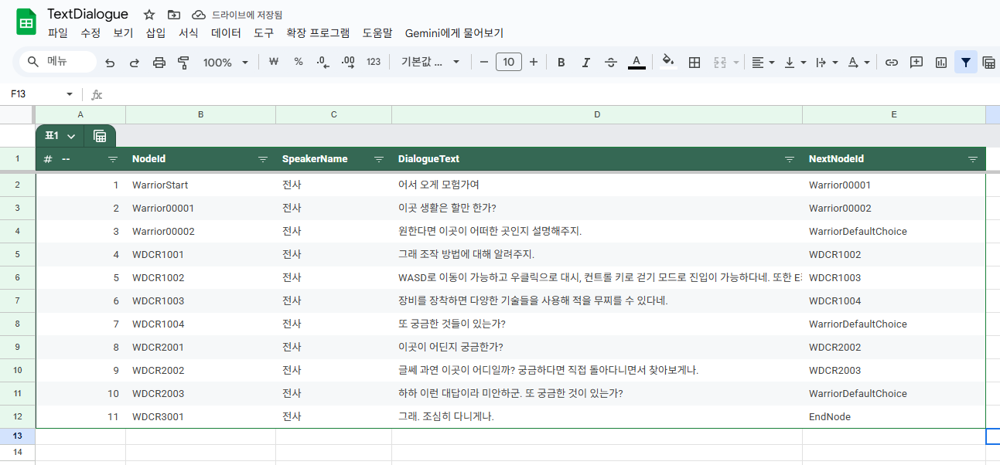

# 01. 목차
- [01. 목차](#01-목차)
- [02. 목차](#02-개요)
- [03. 프로젝트 요약](#03-프로젝트-요약)
- [04. 핵심 기능 및 구현 내용](#04-핵심-기능-및-구현-내용)
	- [04.1 Gameplay Ability System](#041-gameplay-ability-system)
    - [04.2 Inventory System](#042-inventory-system)
    - [04.3 Map Travel](#043-map-travel)
    - [04.4 Object Pooling](#044-object-pooling)
    - [04.5 Save System](#045-save-system)
    - [04.6 Dialogue System](#046-dialogue-system)
---
# 02. 개요
- **프로젝트소개**
    - 리슨 서버 기반 멀티플레이 RPG 게임
- **개발인원**
  - 1명
- **사용엔진**
  - 언리얼 엔진 5.6.1
- **작업 기간**
  - 2025년 8월 21일 ~ 2025년 10월 28일 (약 2달)
---
# 03. 프로젝트 요약
- **장르**
  - 3D Action RPG Game


- **게임특징**
  - 리슨 서버를 통한 멀티플레이를 구현하였으며 서버와 클라이언트의 역할을 분리하여 최대한 데디케이트 서버 환경과 유사한 구조로 설계하였습니다.
  - Gameplay Ability System 프레임워크를 이용하여 일반적인 온라인 RPC 게임처럼 몬스터를 잡고 레벨을 올리며 능력치를 강화하고 아이템을 장착하는 등의 기능을 구현하였습니다.
  

- **주요기능 요약**
    - **캐릭터 성장 시스템**  
    `Gameplay Ability System`을 이용하여 **Attribute**를 구현하였으며 몬스터를 처치시 경험치를 획득하여 Attribute를 강화하고 아이템을 장착하여 캐릭터가 더 강해지도록 제작하였습니다.
    - **멀티플레이**  
  리슨서버를 사용하여 멀티플레이를 구현하였으며 **Replication**을 통하여 클라이언트에서도 정상적으로 Actor가 복제되게 설정하였고 RPC를 통하여 서버와 클라이언트간에 데이터를 주고 받아 둘의 역할을 분리시켰습니다. 
    - **저장 및 불러오기**  
  캐릭터의 Attribute나 Map 위치, 인벤토리등을 호스트(서버)의 디스크에 기록하며 `클라이언트에서도 데이터를 저장`하고 가져올 수 있게 매우 간단한 로그인 시스템을 구현하였습니다.
    - **Object Pooling System**  
    `오브젝트 풀`을 사용하여 Projectile이나 Emeny와 같이 자주 소환되는 Actor들은 Object Pool에 저장하고 필요시 꺼내 사용하여 성능을 최적화 하였습니다.
  - **모듈화**  
    각각의 기능들을 독립적으로 모듈화하여 Core 모듈을 제외하고는 각각의 모듈들은 서로 의존성이 없어 독립적으로 개발이 가능합니다.
  - **다이얼로그 시스템**  
  노드 기반의 다이얼로그 시스템을 구현하여 다양한 분기의 대화를 쉽게 처리할 수 있도록 하였습니다.
---
# 04. 핵심 기능 및 구현 내용

- [04.1 Gameplay Ability System](#041-gameplay-ability-system)
- [04.2 Inventory System](#042-inventory-system)
- [04.3 Map Travel](#043-map-travel)
- [04.4 Object Pooling](#044-object-pooling)
- [04.5 Save System](#045-save-system)
- [04.6 Dialogue System](#046-dialogue-system)
      
## 04.1 Gameplay Ability System
GAS를 사용하여 Attribute와 Ability 기능을 구현하였습니다.

### 04.1.1 Attribute 적용  
Attribute는 1차 속성(힘, 지능, 민첩, 활력)과 이에 파생되는 2차 속성으로 나누어 집니다. 1차 Attribute는 데이터 테이블에서 관리하고 있으며 캐릭터마다 네임을 설정하여 Row 데이터를 가져와 적용합니다.

```c++
// 데이터 테이블에서 Attribute를 가져와 적용하는 로직
void ABrandNewPlayerCharacter::ApplyPrimaryAttributeFromDataTable() const
{
	if (!HasAuthority()) return;
	
	// ... (유효성 확인부분 생략)
	
	static const FString ContextString(TEXT("Primary Attribute Data"));
	if (const FPrimaryAttributeDataRow* FoundRow = AttributeDataTable->FindRow<FPrimaryAttributeDataRow>(AttributeTableKeyName, ContextString))
	{
		FBaseAttributePrams AttributePrams;
		AttributePrams.Strength = FoundRow->Strength;
		AttributePrams.Dexterity = FoundRow->Dexterity;
		AttributePrams.Intelligence = FoundRow->Intelligence;
		AttributePrams.Vitality = FoundRow->Vitality;
		AttributePrams.Level = 1.f;
		
		UCharacterFunctionLibrary::ApplyPrimaryAttributesSetByCaller(AttributePrams, AbilitySystemComponent, PrimaryAttributeEffect);
	}
}
```
데이터 테이블에서 Attribute를 설정한 이유는 다수의 캐릭터가 존재하게 되더라도 외부에서 쉽게 각각의 캐릭터마다 다른 초기 속성을 지정하게 하고 싶었기 때문입니다.

1차 속성이 설정되면 이후 2차 속성이 적용되며 2차 속성의 경우 Gameplay Mod Magnitude Calculation (MMC)를 통해 설정하여 다양한 공식을 적용할 수 있게 하였습니다.

### 04.1.2 능력치 강화


캐릭터 인포메이션에 있는 각각의 위젯에는 Gameplay Tag와 FGameplayAttribute 구조체가 연결되어 있어 Gameplay Tag만 지정하면 Attribute 값을 가져올 수 있게 설정하였습니다.<br>

스탯 포인트가 0 이상일 경우 강화 버튼이 활성화 되며 +버튼이나 -버튼을 누르면 Map에 Gameplay Tag와 float 값을 저장하고 서버에 보내 Attribute를 강화할 수 있도록 구현하였습니다.

```c++
// Widget Controller Class

// 위젯에서 위젯 컨트롤러에 강화할 Attribute의 정보가 담긴 TMap을 보냄. 
void UCharacterInfoWidgetController::UpgradeAttribute(const TMap<FGameplayTag /* 강화할 스탯의 태그 */, float /* 강화할 수치 */>& AttributeUpgradeMap)
{
    
	IBrandNewPlayerInterface* PlayerInterface = Cast<IBrandNewPlayerInterface>(ControlledPawn);
	if (!PlayerInterface) return;
	
	// TMap을 구조체로 변환
	TArray<FAttributeUpgradePrams> UpgradePrams;
	for (const TPair<FGameplayTag, float>& UpgradeData : AttributeUpgradeMap)
	{
		if (!UpgradeData.Key.IsValid()) continue;
		FAttributeUpgradePrams UpgradePram(UpgradeData.Key, UpgradeData.Value);

		UpgradePrams.Add(UpgradePram);
		
	}
	
	// 인터페이스를 통해 캐릭터 클래스에 데이터 전송
	PlayerInterface->UpgradeAttribute(UpgradePrams);
	
}
	
// Character Class
void ABrandNewPlayerCharacter::UpgradeAttribute(const TArray<FAttributeUpgradePrams>& AttributeUpgradePrams)
{
	// ... (null check)
	
	// 서버 RPC로 Attribute 강화 요청
	Server_RequestUpgradeAttribute(AttributeUpgradePrams);
	
}

void ABrandNewPlayerCharacter::Server_RequestUpgradeAttribute_Implementation(const TArray<FAttributeUpgradePrams>& AttributeUpgradePrams)
{
	// ... (Effect Context 및 Spect Handle 생성)

	int32 ConsumedStatPoint = 0;
	
	for (const FAttributeUpgradePrams& UpgradePrams : AttributeUpgradePrams)
	{
		if (!UpgradePrams.TagToUpgrade.IsValid()) continue;
		
		// 사용한 스탯 포인트 저장
		ConsumedStatPoint += UpgradePrams.UpgradeAmount;
		
		// Set by Caller를 사용해 강화 수치 설정
		UAbilitySystemBlueprintLibrary::AssignTagSetByCallerMagnitude(SpecHandle,UpgradePrams.TagToUpgrade, UpgradePrams.UpgradeAmount);
	}
	
	// 강화에 사용한 스탯 포인트와 현재 남은 스탯포인트 비교해서 강화 가능한지 확인
	if (GetAttributeValueByTag(BrandNewGamePlayTag::Attribute_Experience_AttributePoint) < ConsumedStatPoint) return;
	
	//  ... (실제 Effect 적용)
	
}
```
위젯 컨트롤러에서 플레이어 캐릭터로 강화 정보를 보내는 로직입니다.<br>  
RPC로는 TMap을 바로 보낼 수 없기 때문에 구조체로 변환하여 서버로 데이터를 보냅니다. 서버에서는 강화를 하기 전 Stat Point를 확인하여 부정한 Attribute 강화를 차단하고 Gameplay Effect를 통해 Attribute를 강화합니다.

### 04.1.3 Ability  

플레이어나 에너미의 어빌리티는 데이터에셋에 지정되고 게임 시작시 데이터 에셋을 순회하여 어빌리티를 적용합니다.

Active Ability는 태그를 통해 Input Action과 매핑이 되어 있어 Input Action이 Trigger되면 어빌리티가 발동됩니다.

> [Ability 소개 문서]()

어빌리티와 관련된 부분은 별도의 문서로 분리하였습니다.

[⬆️ **Top으로 이동**](#04-핵심-기능-및-구현-내용)

---

## 04.2 Inventory System
인벤토리는 Actor Componen로 구현하였으며 플레이어 스테이트 클래스에서 보관하고 있습니다.<br>  
플레이어 스테이트에서 보관하는 이유는 비록 본 프로젝트는 단 하나의 캐릭터만 조종하지만 실제 상용 게임임들은 여러 캐릭터를 조종하는 경우가 많고 이때 인벤토리는 공유하는 경우가 대부분이기 때문에 캐릭터 클래스에서 인벤토리를 보관하기 부적절하다고 판단하여 플레이어 스테이트 클래스에 보관하게 되었습니다.

### 04.2.1 Iten Info Data Table  


```c++
// 게임 인스턴스의 Init 함수 중 일부로 데이터 테이블로부터 아이템 정보를 가져와 Map에 저장하였습니다.
void UBrandNewGameInstance::Init()
{
	Super::Init();

    // ...(유효성 체크부분 생략)

	// 데이터 테이블의 Row 구조체가 설정한 구조체와 맞는지 확인
	if (ItemDataTable->GetRowStruct() == FItemDataRow::StaticStruct())
	{
		for (const TPair<FName, unsigned char*>& RowMap : ItemDataTable->GetRowMap()) // 데이터 테이블을 순회하여 아이디와 아이템 정보를 저장
		{
			const FItemDataRow* ItemData = reinterpret_cast<FItemDataRow*>(RowMap.Value); // // 구조체 안정성을 확보하였기 때문에 reinterpret_cast 진행
			ItemIdMap.Add(ItemData->ID, *ItemData); // Key = Item Id, Value = 아이템정보가 담긴 구조체
		}
	}
}
```
아이템 정보를 데이터 테이블에 저장하고 이 데이터를 Game Instance 클래스에 Id 기반의 Map으로 저장하여 아이템 정보를 Id만 가지고 빠르게 접근할 수 있도록 하였습니다.

### 04.2.2 Item 획득

 

아이템은 몬스터 처치시 일정확률로 스폰되며 이 아이템에 오버랩되면 Id를 통해 아이템 정보를 가져오고 Interaction 키(F)를 눌러 아이템을 획득 할 수 있습니다.
```c++
void ABrandNewPlayerCharacter::AddOverlappedItem(AActor* OverlappedItem)
{
	if (HasAuthority())
	{
		OverlappedItems.Add(OverlappedItem); // 서버에서 실제 오버랩된 아이템된 아이템
	}
	else
	{
		OverlappedItemsForUI.Add(OverlappedItem); // 클라이언트 UI 표시용 오버랩된 아이템
	}
	SendPickupInfoToUi(OverlappedItem, true);
	
}
```
아이템과 오버랩시 호출되는 함수입니다. 서버와 클라이언트간에 아이템을 저장하는 배열을 분리하였는데 아이템 습득시 오직 서버에만 존재하는 오버랩된 아이템 정보를 가지고 아이템 획득 작업을 진행하여 부정한 아이템 획득을 방지하였습니다.  

다만 클라이언트도 화면에 보여주고 제거할때 오버랩 된 아이템들이 어떤 것인지 알아야하기 때문에 클라이언트 전용 배열에 저장하였으며 이때 RPC나 Replication을 사용하지 않은 이유는 단순히 화면에만 보여주는 것이 목적이기 때문에 굳이 네트워크 트래픽을 증가시킬 필요가 없다고 판단하였기 때문입니다.

### 04.2.3 Inventory  
인벤토리 클래스에서는 구조체로 아이템 정보를 저장하고 있습니다.
```c++
////// 구조체 정보//////

/* 인벤토리 슬롯 하나에 담겨 있는 아이템 정보 */
USTRUCT(BlueprintType)
struct FInventorySlotData
{
	GENERATED_BODY()

	/* 아이디를 저장하여 TMap에서 아이템 정보를 가져옴 */
	UPROPERTY(BlueprintReadOnly)
	int32 ItemID = INDEX_NONE;
	
	// 한 슬롯에 저장된 아이템의 수
	UPROPERTY(BlueprintReadOnly)
	int32 Quantity = 0;
	
	// 아이템 장착 여부
	UPROPERTY(BlueprintReadOnly)
	bool bIsEquipped = false;
	
};

/* 전체 인벤토리 */
USTRUCT(BlueprintType)
struct FInventoryContents
{
	GENERATED_BODY()

	UPROPERTY(BlueprintReadOnly)
	TArray<FInventorySlotData> WeaponSlots = TArray<FInventorySlotData>(); // 무기
	
	UPROPERTY(BlueprintReadOnly)
	TArray<FInventorySlotData> ArmorSlots = TArray<FInventorySlotData>(); // 방어구
	
	UPROPERTY(BlueprintReadOnly)
	TArray<FInventorySlotData> EatablesSlots = TArray<FInventorySlotData>(); // 소비
	
};

// Inventory Class에 저장되어있는 인벤토리 변수
UPROPERTY(Replicated)
FInventoryContents ItemInventory;
```
아이템 저장은 인벤토리 클래스에 Id와 Quantity를 넘기면 인벤토리 클래스에서 배열을 추가하는 방식으로 구현하였습니다.<br>  
인벤토리는 복제가 설정되어 있어 서버에서 설정하면 클라이언트로 전파가 됩니다. 이때 인벤토리는 현재 자기 자신의 인벤토리밖에 볼 수 없기되어있기 때문에 `DOREPLIFETIME_CONDITION(ThisClass, ItemInventory, COND_OwnerOnly);` 조건을 주어 네트워크 최적화를 이루었습니다. 

### 04.2.4 아이템 장착 및 사용  
소비 아이템의 경우 Instance Gameplay Effect를 주어 즉각적으로 체력등 Attribute에 영향을 줍니다.<br>  
장비 아이템의 경우 Infinite Gameplay Effect를 주고 Effect Handle을 저장하여 무기 변경시 Effect를 제거하고 새로 주는 방식으로 효과를 바꿔주었습니다.<br>
```c++
// 아이템용 Attribute 예시
UPROPERTY(ReplicatedUsing = OnRep_ItemStrength)
FGameplayAttributeData ItemStrength;
ATTRIBUTE_ACCESSORS(ThisClass, ItemStrength);
```
장비 아이템은 Primary Attribute를 직접 올리는 것이 아니라 Item 전용 Attribute를 올리도록 설계하였습니다. <br>


이렇게하여 세이브시 순수한 캐릭터의 Attribute만 저장이 가능하고, UI에도 장비 아이템으로 올린 수치만 따로 보여줄 수 있게 하였습니다.

> Github Link
> 
> - [아이템 소비 함수](https://github.com/jinjinchoi/BrandnewGame/blob/main/Source/CharacterModule/Private/Character/BrandNewPlayerCharacter.cpp#L914)  
> - [아이템 장착 함수](https://github.com/jinjinchoi/BrandnewGame/blob/main/Source/CharacterModule/Private/Character/BrandNewPlayerCharacter.cpp#L959)

[⬆️ **Top으로 이동**](#04-핵심-기능-및-구현-내용)

## 04.3 Map Travel
Level Travel은 새게임이나 로드, 게임 내에서 Entrance Actor에 접근할때 진행합니다. 레벨은 Non Seamless Travel 방식으로 이동하며 트랜지션 맵으로 이동한 후 이동할 레벨을 비동기적으로 로드하는 방식으로 구현하였습니다. 

### 04.3.1 Transition Map


Transition Map에서는 로딩 화면을 보여주면서 동시에 비동기적으로 다음 이동할 맵을 로드하며 모든 클라이언트가 로드가 완료되면 서버(호스트)가 다음 맵으로 이동하는 작업을 진행합니다.<br>  

 <br>

트랜지션 맵에 도착하면 서버(호스트)는 레벨매니저 서브시스템에 비동기 로드를 요청합니다. 레벨 매니저 서브 시스템은 미리 저장해놓았던 에셋 경로를 바탕으로 비동기 로드 작업을 수행합니다.

### 04.3.2 Level Manager SubSystem  
레벨 매니저 서브시스템은 실제 비동기 작업을 수행하고 완료 결과를 위젯에 알리며 모든 클라이언트가 준비가 되면 맵을 이동시키는 역할을 수행합니다.
    ```c++
    // 실제 비동기 로드를 진행시키는 함수
    void UBrandNewLevelManagerSubsystem::StartAsyncLoading()
    {
        // ... (유효성 확인 부분 생략)
  
      // 비동기 로드
      LoadPackageAsync(
        TargetLevelPath.ToString(),
        FLoadPackageAsyncDelegate::CreateUObject(this, &UBrandNewLevelManagerSubsystem::OnLoadPackageCompleted),
        0,
        PKG_ContainsMap);
    
    }
    
    // 비동기 로드 완료시 위젯에 성공 여부 Broad Cast
    void UBrandNewLevelManagerSubsystem::OnLoadPackageCompleted(const FName& PackageName, UPackage* LoadedPackage, EAsyncLoadingResult::Type Result)
    {
        if (Result == EAsyncLoadingResult::Succeeded)
        {
            OnAsyncLoadingCompleteDelegate.Broadcast(true);
        }
        else
        {
            OnAsyncLoadingCompleteDelegate.Broadcast(false);
        }
    }
    ```
  로딩 완료후 플레이어가 키보드 입력을 하면 레벨 매니저 서브 시스템에 로드 완료 여부를 알리고 레벨 매니저 서브시스템은 모든 클라이언트의 로딩이 완료되면 실제 레벨 이동을 진행합니다.

    > - Gibug Link  
    >   - [Level Manager Subsystem.h](https://github.com/jinjinchoi/BrandnewGame/blob/main/Source/CoreModule/Public/Game/Subsystem/BrandNewLevelManagerSubsystem.h)
    >   - [Level Manager Subsystem.cpp](https://github.com/jinjinchoi/BrandnewGame/blob/main/Source/CoreModule/Private/Game/Subsystem/BrandNewSaveSubsystem.cpp)

### 04.3.3 Client의 맵 이동  
트랜지션 맵에 클라이언트의 로그인이 감지되면 서버에서 로드할 에셋 경로 알려주어 클라이언트에서 맵 로딩을 할 수 있도록 해줍니다.

```c++
// 트랜지션 게임 모드 클래스
void ATransitionGameMode::PostLogin(APlayerController* NewPlayer)
{
	Super::PostLogin(NewPlayer);
	
	const FString TargetLevelPath = GetGameInstance()->GetSubsystem<UBrandNewLevelManagerSubsystem>()->GetTraveledLevelPath().ToString();
	
	// 서버에서 로그인을 감지하면 플레이어 컨트롤러에 로드할 에셋 경로를 알려줍니다.
	if (IUIPlayerControllerInterface* UIPlayerController = Cast<IUIPlayerControllerInterface>(NewPlayer))
	{
		UIPlayerController->SetTraveledMapPathToClient(TargetLevelPath);
	}
	
}

// 트랜지션 플레이어 컨트롤러 클래스
void AUIPlayerController::SetTraveledMapPathToClient(const FString& MapPath)
{
	if (!HasAuthority()) return;
	
	// 서버의 플레이어 컨트롤러는 에셋 경로를 받은 뒤 RPC로 클라이언트에 에셋 경로를 보냅니다.
	Client_SetTraveledMapPath(MapPath);
	
}

void AUIPlayerController::Client_SetTraveledMapPath_Implementation(const FString& MapPath)
{
    // 클라이언트 자신의 서브시스템에 접근하여 맵 로딩을 시작합니다.
	if (UBrandNewLevelManagerSubsystem* LevelManagerSubsystem = GetGameInstance()->GetSubsystem<UBrandNewLevelManagerSubsystem>())
	{
		LevelManagerSubsystem->SetMapNameToTravelByString(MapPath);
		LevelManagerSubsystem->StartAsyncLoading();
	}
	
}
```
서버의 서브시스템에서 바로 클라이트의 서브시스템에 접근할 방법이 없기 때문에 플레이어 컨트롤러를 통해 우회작업을 진행하였습니다.<br>  
맵 이동 전 클라이언트에 로드할 에셋 경로를 설정하지 않은 이유는 현재 Non Seamless Travel을 사용하기 때문에 트랜지션 맵으로 이동할 때 네트워크 연결이 다시 일어나고 서버는 클라이언트가 처음부터 같이 있었는지 트랜지션 맵에서 합류하였는지 알 방법이 없어집니다.<br>  
그렇기에 호스트가 트랜지션 맵에 있을 때 기존에 있던 클라이언트가 아닌 완전히 새로운 클라이언트의 참여를 막을 방법이 없다고 생각하여 트랜지션 맵에 있을때 로딩할 맵을 모르는 새로운 클라이언트가 접속하여도 문제가 없도록 설계하였습니다.<br>  

물론 트랜지션 맵에서 로딩할 맵을 모르는 클라이언트는 Kick 하는 방식으로도 대비가 가능하긴 하지만 또 다른 문제로는 맵 이동전에 클라이언트에게 RPC로 알려주면 클라이언트가 설정 완료 여부를 다시 서버에 RPC로 알려줘야 하는데 이때 네트워크 환경에 따라 딜레이가 발생할 수 있으며 이는 저장 타이밍의 문제 발생이나 유저 경험을 해칠 수 있다고 생각하였습니다.<br>  
그렇기에 트랜지션 맵에서 RPC를 사용하였으며 이때는 딜레이가 발생하더라도 크게 문제가 발생할 가능성이 낮고 플레이어 입장에서도 원래 로딩 시간이라 느끼게 하여 유저 경험을 향상 시키는 효과를 주었습니다. 
```c++

// 로드 완료된 클라이언트 등록
void UBrandNewLevelManagerSubsystem::RegisterPlayerLoaded(const APlayerController* NewPlayer)
{
	LoadedPlayerControllerSet.Add(NewPlayer);
	CheckAllPlayersLoaded();
	
}
// 로드가 완료된 플레이어가 트랜지션 맵에 있을때 접속을 종료하면 배열에서 제거 (게임모드 클래스에서 호출)
void UBrandNewLevelManagerSubsystem::UnregisterPlayerLoaded(const APlayerController* ExitingPlayer)
{
	LoadedPlayerControllerSet.Remove(ExitingPlayer);
	CheckAllPlayersLoaded();
}

// 모든 클라이언트가 준비 완료되면 맵 이동
void UBrandNewLevelManagerSubsystem::CheckAllPlayersLoaded()
{
	if (LoadedPlayerControllerSet.Num() >= GetWorld()->GetNumPlayerControllers())
	{
		// 이동 작업
		LoadedPlayerControllerSet.Empty();
		TravelMap();
	}
}
```

클라이언트는 로딩이 완료되면 서버에 RPC로 자신이 로딩이 완료되었다는 것을 알리고 서버는 모든 클라이언트가 준비가 되면 맵을 이동합니다.  
이때 클라이언트가 트랜지션 맵에서 나가는 것을 대비하여 게임모드 클래스의 Logout함수를 오버라이드하여 플레이어가 게임에서 나갈때 배열에서 제거하는 작업을 진행합니다.

### 04.3.4 Map Entrance Actor  
  Map Entrance Actor는 모든 플레이어가 오버랩 되면 서버의 레벨 매니저 서브시스템에 이동할 맵 경로를 설정하고 트랜지션 맵으로 이동시킵니다.
```c++
// 유효하지 않은 플레이어(중간에 나간 플레이어) 제외
void AMapEntrance::CleanupInvalidActors()
{
	for (auto It = OverlappingActors.CreateIterator(); It; ++It)
	{
		if (!It->IsValid())
		{
			It.RemoveCurrent();
		}
	}
}

// 플레이어가 오버랩 될때마다 호출되는 함수
void AMapEntrance::CheckAllPlayersOverlapped()
{
	CleanupInvalidActors(); // 유효하지 않은 플레이어 처리

	if (!HasAuthority()) return;

	const ABrandNewGameState* BrandNewGameState = Cast<ABrandNewGameState>(GetWorld()->GetGameState());
	if (!BrandNewGameState) return;
	
	// 오버랩 된 액터와 플레이어의 수가 같으면 맵 이동
	if (OverlappingActors.Num() == BrandNewGameState->PlayerArray.Num())
	{
		UBrandNewLevelManagerSubsystem* LevelManagerSubsystem = GetGameInstance()->GetSubsystem<UBrandNewLevelManagerSubsystem>();
		if (!LevelManagerSubsystem) return;
		
		// 맵 이동 전 모든 플레이어 데이터 저장
		for (TWeakObjectPtr<AActor>& WeakActor : OverlappingActors)
		{
			if (AActor* Actor = WeakActor.Get())
			{
				if (IBrandNewPlayerInterface* PlayerInterface = Cast<IBrandNewPlayerInterface>(Actor))
				{
					PlayerInterface->SavePlayerDataForTravel();
				}
				
			}
		}

		LevelManagerSubsystem->SetMapNameToTravel(LevelToTravelClass);
		LevelManagerSubsystem->TravelToTransitionMap(TransitionLevelClass);
	}
	
}
```
플레이어가 오버랩 될 때 마다 CheckAllPlayersOverlapped 함수를 호출하여 오버랩 된 플레이어 수와 전체 플레이어 수를 비교하여 둘이 동일해지면 맵 이동을 시작합니다.<br>  
맵 이동 시 데이터를 저장하는데 이때는 디스크에 데이터를 저장하는 것이 아니라 세이브 매니저 서브시스템에 존재하는 임시 데이터 보관 Map에 데이터를 보관하게 됩니다.

```c++
// Save Manager Subsystem에 있는 맵 이동시 임시로 데이터를 저장하는 Map
TMap<FString /* Player Unique Id */, FSaveSlotPrams /* Save Data*/ > LatestPlayerDataMap;
```
보통의 게임들은 자동 저장이 있으면 맵 이동시 디스크에 저장하는 작업을 진행하긴 하지만 본 프로젝트에서는 수동 저장만 가능하게 하기 위해 임시로 데이터를 저장하는 방식을 채택하였습니다.

```c++
//Widget Update 함수 간단 예시

const int32 OverlappedPlayerCount = OverlappingActors.Num(); // Map Entrance Actor와 오버랩된 플레이어 수
const int32 MaxPlayersCount = BrandNewGameState->PlayerArray.Num(); // 전체 플레이어 수
 
// 위젯 생성 요청 및 플레이어 수들 전송
PlayerControllerInterface->HandlePlayerMapEntryOverlap(OverlappedPlayerCount, MaxPlayersCount);
```
Entrance Actor는 현재 오버랩 된 플레이어 수를 보여주는 위젯도 보여줍니다. 이때 Game State에 유저가 접속하거나 나갈때마다 브로드캐스트되는 델리게이트를 생성한 뒤 구독해두어 유저가 새로 나가거나 들어와도 대응이 가능하게 하였습니다.


> Github Link
> - [Map Entrance.h](https://github.com/jinjinchoi/BrandnewGame/blob/main/Source/CharacterModule/Public/Actor/Map/MapEntrance.h)
> - [Map Entrance.cpp](https://github.com/jinjinchoi/BrandnewGame/blob/main/Source/CharacterModule/Private/Actor/Map/MapEntrance.cpp)

[⬆️ **Top으로 이동**](#04-핵심-기능-및-구현-내용)

## 04.4 Object Pooling
오브젝트 풀링 시스템을 구현하여 자주 사용하는 액터는 Pool에서 관리하도록 하였습니다.

### 04.4.1 Objet Pool Manger  
오브젝트 풀 매니저 클래스는 액터들을 미리 생성하고 필요시 꺼내어 사용할 수 있도록 돕는 클래스입니다. 간단한 로직 설명은 다음과 같습니다. 게임이 시작되면(Begin Play) 액터들을 미리 원하는 만큼 생성하고 Hidden으로 설정한 뒤 Pool에 저장해놓았다가 필요시 풀 매니저 클래스에 접근하여 배열에서 액터들을 불러오는 방식을 사용하였습니다.<br>    
풀 매니저는 게임모드에서 관리하는데 이는 현재 스폰 기능이 서버에서만 작동하게 되어 있으며 또한 월드를 이동할때 풀을 자동으로 초기화 하고 싶어 게임모드에서 이를 관리하도록 하였습니다.<br>  
Projectile처럼 Spawn과 Destrory가 매우 빈번하게 일어나는 액터들에 대하여 풀링 시스템을 사용함으로써 GC에 부하를 줄이고 메모리 최적화를 이루었습니다.

> GitHub Link
> - [Object Pool Manager.h](https://github.com/jinjinchoi/BrandnewGame/blob/main/Source/CoreModule/Public/Manager/Pooling/BrandNewObjectPoolManager.h)
> - [Object Pool Manager.cpp](https://github.com/jinjinchoi/BrandnewGame/blob/main/Source/CoreModule/Private/Manager/Pooling/BrandNewObjectPoolManager.cpp)

## 04.5 Save System
세이브 기능을 통해 플레이어의 Attribute와 Inventory, World,  Location을 저장합니다. 

### 04.5.1 Login
로그인의 경우 정말 로그인 자체를 구현하기 보다는 단순히 클라이언트 간에 세이브 슬롯을 구분하기 위하여 사용하였습니다.  
로그인시 Save Subsystem에 입력 값이 저장됩니다.<br>

    ```c++
    // 캐릭터 클래스의 OnRep_PlayerState 함수에서 서버에 자신의 아이디를 보내는 부분
    const UBrandNewSaveSubsystem* SaveSubsystem = GetGameInstance()->GetSubsystem<UBrandNewSaveSubsystem>();
    check(SaveSubsystem);
    Server_RequestInitCharacterInfo(SaveSubsystem->GetUniqueIdentifier());
  
  // Server_RequestInitCharacterInfo 함수내에서 서버에 플레이어 아이디 저장
  PlayerUniqueId = PlayerId;
    ```
    게임이 시작 되면 클라이언트는 세이버 서브시스템에서 설정했던 아이디를 가져와 서버로 보내고 서버 캐릭터 클래스는 해당 아이디를 저장합니다.<br>  
    위와 같이 구현한 이유는 랜 커넥션으로 연결중이기 때문에 고유 아이디를 설정할 방법이 마땅치 않으며 서버에서 바로 클라이언트의 서브시스템에 접근하지 못하기 때문에 클라이언트에서 서버로 자신의 아이디를 보내고 이를 서버에서 저장하는 방식을 선택하였습니다.


### 04.5.2 Save  
세이브 요청은 호스트만 할 수 있습니다. 클라이언트에서 요청해서 세이브 하는 것도 가능하지만 실제 온라인 게임의 경우 세이브 타이밍은 서버에서만 판단하고 비록 호스트의 경우 클라이언트로도 볼 수 있지만 서버 권한이 있기 때문에 호스트에게 세이브 권한을 주어도 된다고 판단하였습니다. <br>  

```c++

// Blueprint Function Library Class

// 서버(호스트)가 세이브 버튼을 누를 때 실행되는 함수
void UUIFunctionLibrary::RequestSave(ACharacter* PlayerCharacter, const FString& SlotName, const int32 SlotIndex)
{
	if (!PlayerCharacter || !PlayerCharacter->HasAuthority() || !PlayerCharacter->GetWorld()) return;
	
	// Game State를 가져옴
	if (AGameStateBase* GameState = PlayerCharacter->GetWorld()->GetGameState())
	{
		// Player Array를 순회
		for (const TObjectPtr<APlayerState>& PlayerState : GameState->PlayerArray)
		{
			if (!PlayerState) continue;
			
			if (IBrandNewPlayerInterface* PlayerInterface = Cast<IBrandNewPlayerInterface>(PlayerState->GetPawn()))
			{
				// 플레이어의 서버측 Pawn을 가져와 유효하면 세이브 작업 요청
				PlayerInterface->RequestSave(SlotName, SlotIndex);
			}
		}
	}
}
```
호스트가 세이브 버튼을 누르면 모든 플레이어를 순회하여 캐릭터 클래스에 슬롯 정보를 보내 해당 슬롯에 데이터를 저장할 것을 요청합니다.<br>  


```c++
// Character class

void ABrandNewPlayerCharacter::RequestSave(const FString& SlotName, const int32 SlotIndex)
{
	if (!HasAuthority() || !AbilitySystemComponent || !AttributeSet || !GetPlayerState()) return;
	
	const UBrandNewSaveSubsystem* SaveSubsystem = GetGameInstance()->GetSubsystem<UBrandNewSaveSubsystem>();
	if (!SaveSubsystem) return;

	const FSaveSlotPrams SaveSlotPrams = MakeSaveSlotPrams();
	SafeLocation = SaveSlotPrams.CharacterLocation;
	
	SaveSubsystem->SaveGameToSlotWithId(SlotName, SlotIndex, SaveSlotPrams, PlayerUniqueId);
	
}
```
캐릭터 클래스에서는 자신의 정보들을 모아 SaveSubsystem에 보내고 SaveSubsystem에서 저장작업을 진행합니다.

> GitHub Link   
> - [세이브 정보를 담은 구조체를 생성하는 MakeSaveSlotPrams 함수](https://github.com/jinjinchoi/BrandnewGame/blob/main/Source/CharacterModule/Private/Character/BrandNewPlayerCharacter.cpp#L837)
> - [Save Subsystem에서 세이브 하는 함수](https://github.com/jinjinchoi/BrandnewGame/blob/main/Source/CoreModule/Private/Game/Subsystem/BrandNewSaveSubsystem.cpp#L10)

### 04.5.3 Load
로드 작업 역시 서버에서만 진행합니다. 로드 슬롯을 선택하고 게임에 접속하면 세이브 서브시스템에 선택했던 슬롯 네임과 인덱스를 저장하여 둡니다.
```c++
void ABrandNewPlayerCharacter::OnRep_PlayerState()
{
	Super::OnRep_PlayerState();
	
    // ... ASC, HUD 등등 초기화 하는 로직 생략 

	if (IsLocallyControlled())
	{	
		const UBrandNewSaveSubsystem* SaveSubsystem = GetGameInstance()->GetSubsystem<UBrandNewSaveSubsystem>();
		check(SaveSubsystem);
		// Server RPC를 통해 Id를 보내 로드 요청
		Server_RequestInitCharacterInfo(SaveSubsystem->GetUniqueIdentifier());
	}
	
}
```
게임이 시작된 직후에 클라이언트는 서버에 자신의 아이디를 보내며 로드를 요청합니다.

```c++
void ABrandNewPlayerCharacter::Server_RequestInitCharacterInfo_Implementation(const FString& PlayerId)
{

	UBrandNewSaveSubsystem* SaveSubsystem = GetGameInstance()->GetSubsystem<UBrandNewSaveSubsystem>();
	PlayerUniqueId = PlayerId; // 아이디를 캐릭터 클래스에 설정.

	
	if (const FSaveSlotPrams SaveSlotPrams = SaveSubsystem->GetLatestPlayerData(PlayerId); SaveSlotPrams.bIsValid) // 맵 이동인지 접속인지 확인
	{
		// 맵 이동일 경우 SaveSubsystem에 있는 LatestPlayerData로 복구
		LoadCharacterData(SaveSlotPrams);
		SaveSubsystem->RemoveLatestPlayerData(PlayerId);
	}
	else
	{
		// 접속인 경우 로드인지 뉴게임인지 확인하고 데이터 복구
		InitializeCharacterInfo(PlayerId);
	}
	
}
```

클라이언트의 로드 요청을 받고 서버는 맵 이동이었는지 아니면 로드로 월드에 접속한 것인지 구분합니다. 맵 이동일 경우 임시로 저장한 데이터를 불러오고 로드인 경우 저장해두었던 세이브 슬롯과 인덱스 및 클라이언트의 아이디를 통해 세이브 파일을 불러옵니다.

```c++
// Load인지 New Game인지 구분하고 처리하는 함수
void ABrandNewPlayerCharacter::InitializeCharacterInfo(const FString& UniqueId)
{
	if (!HasAuthority()) return;

	const UBrandNewSaveSubsystem* SaveSubsystem = GetGameInstance()->GetSubsystem<UBrandNewSaveSubsystem>();
	if (!SaveSubsystem) return;
	
	if (SaveSubsystem->IsLoadedWorld()) // 로드로 접속인지 확인
	{
		const FSaveSlotPrams SavedData = SaveSubsystem->GetCurrentSlotSaveDataById(UniqueId);
		checkf(SavedData.bIsValid, TEXT("세이브 로직 잘못됐을 가능성 있음. 로드한 세계인데 데이터 유효성 확인 실패. 세이브 로직 다시 확인해봐야함"))

		// 처음 접속인데 로드를 통해 들어온 것이면 SavedData를 가져와서 데이터 복구
		LoadCharacterData(SavedData);
		return;
	}
	
    // ... (New gmae 처리하는 로직이 있는 부분으로 데이터 테이블로부터 기본 데이터를 가져와 Attribute 등을 설정)  

}

// 로드 작업하는 함수
void ABrandNewPlayerCharacter::LoadCharacterData(const FSaveSlotPrams& SavedDataToApply)
{
	if (!SavedDataToApply.bIsValid) return;
	
	// SetByCaller로 Primary Attribute, 레벨, 경험치, 스탯포인트 로드 
	ApplyPrimaryAttributeFromSaveData(SavedDataToApply.AttributePrams);
	
	ApplyGameplayEffectToSelf(SecondaryAttributeEffect, 1.f);
	ApplyGameplayEffectToSelf(RegenerationEffect, 1.f);
	
	// 현재 체력 및 마력 로드 - 현재 체력마력은 최대 체력마력을 넘길 수 없어 최대 체력마력을 먼저 로드 후 작업함
	OverrideVitalAttribute(SavedDataToApply.AttributePrams.CurrentHealth, SavedDataToApply.AttributePrams.CurrentMana);
	// 인벤토리 로드
	LoadInventory(SavedDataToApply.InventoryContents);

	// 저장된 지역과 현재 지역이 동일한지 확인하고 동일하면 저장되어 있던 위치로 캐릭터 이동
	const FString MapName = UWorld::RemovePIEPrefix(GetWorld()->GetOutermost()->GetName());
	if (SavedDataToApply.MapPackageName == MapName)
	{
	    MoveCharacterToValidLocation(SavedDataToApply.CharacterLocation);
	}
}
```
로드 작업시 특이 사항으로는 캐릭터의 위치를 로드하는 작업인데 리슨 서버이기 때문에 현재 호스트가 있는 Level(맵)과 클라이언트가 마지막으로 저장했던 Level이 다를 수 있고 그렇기에 저장된 지역과 현재 지역을 비교하여 동일할 경우에만 위치를 로드하는 작업을 합니다.<br>   
마지막으로 인벤토리를 로드하는 부분입니다.
```c++
void ABrandNewPlayerCharacter::LoadInventory(const FInventoryContents& InventoryData)
{
	// ... Player State에서 인벤토리 불러오는 부분 (생략)
	
	Inventory->SetInventoryContents(InventoryData);
	
	if (Inventory->GetLastEquippedWeaponSlotIndex() != INDEX_NONE)
	{
		EquipItem(Inventory->GetLastEquippedWeaponSlotIndex(), EItemType::Weapon);
	}
	if (Inventory->GetLastEquippedArmorSlotIndex() != INDEX_NONE)
	{
		EquipItem(Inventory->GetLastEquippedArmorSlotIndex(), EItemType::Armor);
	}
		
}
```

인벤토리는 구조체 안에 아이템 정보가 담긴 배열을 저장하는 방식으로 구현되어 있는데 아이템 정보는 단순히 Integer와 Boolean 변수만 있기 때문에 Save Game에 통째로 저장이 가능하고 로드 역시 통째로 가져와 단순히 대입하는 방식으로 진행합니다.<br>  
`SetInventoryContents()`함수에서는 불러오기와 동시에 장착 중인 아이템이 있는지를 확인합니다. 이후 캐릭터 클래스에서는 장착 중이었던 아이템이 있는지 확인하고 아이템이 존재하면 Gameplay Effect를 통해 아이템 효과를 부여합니다.  

### 04.5.4 World Travel시 데이터 저장 및 복구  
맵 이동시 실제 데이터를 저장하는 것이 아니라 캐릭터 정보가 담긴 구조체를 아이디와 함께 Map에 저장합니다.
```c++
// Save Subsystem에 존재하는 임시로 데이터를 저장하는 TMap
TMap<FString, FSaveSlotPrams> LatestPlayerDataMap;

// 위에 로드 소개에서 넘어갔던 맵 이동 부분 처리 로직.
if (const FSaveSlotPrams SaveSlotPrams = SaveSubsystem->GetLatestPlayerData(PlayerId); SaveSlotPrams.bIsValid) // 맵 이동인지 접속인지 확인
{
    // 맵 이동일 경우 SaveSubsystem에 있는 LatestPlayerData로 복구
    LoadCharacterData(SaveSlotPrams);
}
else
{
    // ... (생략)
}


// 월드 이동전 데이터 저장 작업. 세이브시 사용했던 MakeSaveSlotPrams() 함수 그대로 사용.
SaveSubsystem->UpdateLatestPlayerDataMap(PlayerUniqueId, MakeSaveSlotPrams());

```
  마찬가지로 맵 이동 전 데이터 세이브도 임시 데이터를 저장하는 방식으로 진행하며 이때 세이브 시 사용하는 구조체를 그대로 사용하여 추가적인 작업없이 간편하게 데이터를 저장하고 불러올 수 있도록 하였습니다.

## 04.6 Dialogue System

### 04.6.1 Dialogue Node  
다이얼로그 시스템은 노드를 기반으로 구현되었습니다. 현재 구현된 노드는 일반 텍스트 노드와 스퀀스 기반의 대화 노드, 선택지 노드, 엔드 노드가 있습니다.
```c++
// 텍스트노드
USTRUCT(BlueprintType)
struct FTextDialogueDataRow : public FTableRowBase
{
	GENERATED_BODY()

	UPROPERTY(EditDefaultsOnly, BlueprintReadOnly)
	FName NodeId = NAME_None; // 노드 아이디
	
	UPROPERTY(EditDefaultsOnly, BlueprintReadOnly)
	FText SpeakerName = FText(); // 현재 말하고 있는 캐릭터 이름
	
	UPROPERTY(EditDefaultsOnly, BlueprintReadOnly)
	FText DialogueText = FText(); // 대화 내용
	
	UPROPERTY(EditDefaultsOnly, BlueprintReadOnly)
	FName NextNodeId = NAME_None; // 다음 노드
	
};

// 시퀀스 노드 (텍스트노드를 상속 받음)
USTRUCT(BlueprintType)
struct FSequenceDialogueDataRow : public FTextDialogueDataRow
{
	GENERATED_BODY()
	
	UPROPERTY(EditDefaultsOnly, BlueprintReadOnly)
	TSoftObjectPtr<ULevelSequence> Sequence = nullptr; // 재생할 시퀀스
	
};

// 선택지 노드
USTRUCT(BlueprintType)
struct FChoiceDialogueDataRow : public FTableRowBase
{
	GENERATED_BODY()

	/* 선택지를 여러개 보여줄 것이기 때문에 선택지를 그룹으로 묶어서 관리. 대화 노드에서 다음 노드로 선택할 노드 이름 */
	UPROPERTY(EditDefaultsOnly, BlueprintReadOnly)
	FName ChoiceGroupId = NAME_None; // 현재 선택지 그룹

	UPROPERTY(EditDefaultsOnly, BlueprintReadOnly)
	FName NodeId = NAME_None; // 선택지 하나의 Id

	UPROPERTY(EditDefaultsOnly, BlueprintReadOnly)
	FText ChoiceText = FText(); // 선택지에 들어갈 텍스트

	UPROPERTY(EditDefaultsOnly, BlueprintReadOnly)
	FName NextNodeId = FName(); // 선택시 갈 다음 노드

};
```


노드의 구조는 위와 같으며 데이터 테이블에서 이를 설정할 수 있습니다. 대화 시스템에 기본적인 로직은 노드를 가져오고 해당 노드의 정보를 UI에 보여준 뒤 다시 대화를 요청하면 다음 노드로 넘어가는 방식으로 진행합니다.

```c++

// 노드를 생성하는 예시 (텍스트 노드)
void UBnDialogueGraph::CreateTextNode()
{
	const UBrandNewGameInstance* BrandNewGameInstance =  GetWorld()->GetGameInstance<UBrandNewGameInstance>();
	if (!BrandNewGameInstance || !BrandNewGameInstance->GetTextDialogueDataTable()) return;
	
	// 게임인스턴승테서 데이터 테이블을 가져와 구조체 타입과 텍스트 노드 데이터 테이블의 구조체 타입과 동일한지 확인
	if (BrandNewGameInstance->GetTextDialogueDataTable()->GetRowStruct() == FTextDialogueDataRow::StaticStruct())
	{
	    // 데이터 테이블 Row 순회
		for (const TPair<FName, unsigned char*>& RowMap : BrandNewGameInstance->GetTextDialogueDataTable()->GetRowMap())
		{
		    // 위에서 이미 타입 확인을 끝내기 때문에 reinterpret_cast 가능. unsigned char 값을 구조체로 변환한 후 노드 설정
			const FTextDialogueDataRow* TextData = reinterpret_cast<FTextDialogueDataRow*>(RowMap.Value);
			UBnDialogueTextNode* TextNode = NewObject<UBnDialogueTextNode>();
			TextNode->NodeId = TextData->NodeId;
			TextNode->NodeType = EDialogueType::Text;
			
			TextNode->DialogueText = TextData->DialogueText;
			TextNode->NextNodeId = TextData->NextNodeId;
			TextNode->SpeakerName = TextData->SpeakerName;

			NodeMap.Add(TextData->NodeId, TextNode);
		}
	}
}
```
노드의 생성 부분 로직입니다.<br>  
게임 인스턴스에 저장된 데이터 테이블을 가져와 올바르게 가져온지 확인한 다음 데이터 테이블을 순회하여 모든 Row들을 Node로 만듭니다.<br>   
그 후 Node Id와 Node를 매핑하기 위해 Map에 노드를 저장합니다. 이때 선택지 노드는 그룹 아이디로 저장을 합니다. <br>  

> Github Link  
> - [전체 노드생성 로직](https://github.com/jinjinchoi/BrandnewGame/blob/main/Source/DialogueModule/Private/Graph/BnDialogueGraph.cpp)

### 04.6.2 일반 대화 노드  
대화 로직 실행은 제일 처음 가져올 대화의 Node Id를 통해 그에 맞는 Node를 가져오는 것으로 시작합니다.
```c++
// 대화 위젯을 생성하는 함수
void ABrandNewHUD::CreateDialogueWidget(const FName& FirstDialogueId)
{
	check(DialogueWidgetControllerClass && DialogueWidgetClass);
	if (!DialogueWidgetControllerClass || !DialogueWidgetClass) return;
	
	// 위젯 컨트롤러 생성
	if (!DialogueWidgetController)
	{
		DialogueWidgetController = NewObject<UDialogueWidgetController>(this, DialogueWidgetControllerClass);
		DialogueWidgetController->SetControlledPawn(GetOwningPlayerController()->GetPawn());
		DialogueWidgetController->BindCallbacksToDependencies();
	}
	
	// 위젯 생성
	if (!DialogueWidget)
	{
		DialogueWidget = CreateWidget<UBrandNewWidget>(GetWorld(), DialogueWidgetClass);
	}
	
	// 첫 대화 노드 ID 설정
	DialogueWidgetController->DialogueId = FirstDialogueId;
	DialogueWidget->SetWidgetController(DialogueWidgetController);
	DialogueWidget->AddToViewport();
	
}
```

대화를 하기 위해서 첫 시작 노드의 아이디를 보내며 위젯 생성을 합니다.

```c++
void UDialogueWidgetController::BroadCastDialogue()
{
	if (DialogueId.IsNone()) return;
	
	// 다이얼로그를 관리하는 서브시스템을 가져옵니다.
	const UDialogueSubSystem* DialogueSubSystem = GetWorld()->GetGameInstance()->GetSubsystem<UDialogueSubSystem>();
	if (!DialogueSubSystem) return;
	
	// 현재 보여줘야할 다이얼로그가 어떤 노드인지 아이디를 기반으로 찾아내어 처리합니다.
	switch (DialogueSubSystem->GetDialogueTypeById(DialogueId))
	{
	case EDialogueType::Text:
		HandleTextNode();
		break;
		
		// ... 나머지 case 생략
	}
	
}
```

그 이후 위젯은 위젯 컨트롤러에 대화 데이터를 보낼 것을 요청하고 위젯컨트롤러는 노드 아이디에 해당하는 노드를 가져와 대화로직을 처리합니다. 

```c++
void UDialogueWidgetController::HandleTextNode()
{
    // 노드를 가져오는 작업 진행
	const UDialogueSubSystem* DialogueSubSystem = GetWorld()->GetGameInstance()->GetSubsystem<UDialogueSubSystem>();
	const UBnDialogueTextNode* TextNode = DialogueSubSystem->GetDialogueNodeById<UBnDialogueTextNode>(DialogueId);
	if (!TextNode) return;

	DialogueId = TextNode->NextNodeId;
	
	// 대화 내용과 말하는 캐릭터 이름 설정
	FTextDialogueParams DialogueParams;
	DialogueParams.Dialogue = TextNode->DialogueText;
	DialogueParams.SpeakerName = TextNode->SpeakerName;
	
	// 위젯으로 데이터 전송
	TextDialogueReceivedDelegate.Broadcast(DialogueParams);
	
}
```


위젯에서는 델리게이트를 바인딩하고 있어 위젯 컨트롤러에서 대화 정보를 BroadCast하면 이 대화를 화면에 보여줍니다.

### 04.6.3 시퀀스 노드  
시퀀스 노드는 기본적으로 텍스트 노드와 동일하지만 시퀀스를 재생한다는 부분만 다릅니다.
```c++
// 시퀀스 플레이 요청
SequenceManager->PlayDialogueSequence(SequenceNode->Sequence);
```
노드에 재생할 시퀀스 정보가 담겨있기 때문에 이를 그대로 시퀀스 매니저 클래스로 보내 재생을 요청합니다.

```c++
// 시퀀스 매니저 클래스에서 시퀀스를 플레이하는 로직
void USequenceManager::PlayDialogueSequence(const TSoftObjectPtr<ULevelSequence> SequenceToPlay)
{
	if (SequenceToPlay.IsNull()) return;
	
	TWeakObjectPtr WeakThis = this;
	
	// 소프트 클래스 로드 작업 실행
	FStreamableManager& Streamable = UAssetManager::GetStreamableManager();
	Streamable.RequestAsyncLoad(SequenceToPlay.ToSoftObjectPath(), [WeakThis, SequenceToPlay]()
	{
		if (!WeakThis.IsValid()) return;
		
		ULevelSequence* LoadedSequence = SequenceToPlay.Get();
		ALevelSequenceActor* OutActor = nullptr;
		
		// 시퀀스 재생 동안 입력 등을 방지하는 설정
		FMovieSceneSequencePlaybackSettings Settings;
		Settings.bDisableLookAtInput = true;
		Settings.bDisableMovementInput = true;
		Settings.bHidePlayer = true;
		Settings.bPauseAtEnd = true; // 시퀀스가 종료되도 대화창 열려있으면 시퀀스 종료안하고 대기
		
		ULevelSequencePlayer* Player = ULevelSequencePlayer::CreateLevelSequencePlayer(
			WeakThis->GetWorld(),LoadedSequence, Settings, OutActor);

		if (Player)
		{
		    // 시퀀스 재생
			Player->Play();
			
			// 이미 재생중이었던 시퀀스가 있으면 재생 종료
			if (WeakThis->LastSequencePlayer)
			{
				WeakThis->LastSequencePlayer->Stop();
			}
			
			// 차후 종료하기 위하여 재생한 시퀀스 저장
			WeakThis->LastSequencePlayer = Player;
		}
		
	});
	
}
```

시퀀스는 메모리 낭비를 막기 위해 소프트 오브젝트로 가지고 있으며 이를 로드한 뒤 사용합니다. 전에 재생중이었던 시퀀스가 있으면 종료시키고 새로 시퀀스를 재생하는 작업을 진행합니다.

```c++
// 다이얼로그 시퀀스를 종료 시키기 위해 호출하는 함수
void USequenceManager::FinishDialogueSequence()
{
	if (LastSequencePlayer)
	{
		LastSequencePlayer->Stop();
		LastSequencePlayer = nullptr;
		
		APlayerController* PC = GetWorld()->GetFirstPlayerController();
		if (APawn* Pawn = PC->GetPawn())
		{
			PC->SetViewTarget(Pawn);
		}
	}
	
}
```
EndNode를 만나면 다이얼로그가 종료되었다고 판단하고 시퀀스 종료 함수를 호출한 뒤 다이얼로그를 종료합니다.

### 04.6.4 선택지 노드  
위에서 생략된 선택지 노드는 다음과 같은 방식으로 생성됩니다.
```c++
// 선택지 노드 생성 코드 중 발췌

// ... (데이터 데이블 Row 순회중)

// Node Id와 Node Class가 묶여 저장된 Map에 동일한 그룹 아이디를 가진 이미 존재하는지 확인
if (UBnDialogueNodeBase** ExistedNodePtr = NodeMap.Find(ChoiceDialogueData->ChoiceGroupId))
{
    if (UBnDialogueChoiceNode* ChoiceNode = Cast<UBnDialogueChoiceNode>(*ExistedNodePtr))
    {
        // 이미 선택지 배열이 존재하면 배열에 추가 선택지를 배열에 추가
        ChoiceNode->DialogueChoices.Add(ChoiceNodeInfo);
    }
}
else // 배열이 아직 존재하지 않으면 새로 만들어서 추가.
{
    UBnDialogueChoiceNode* ChoiceNode = NewObject<UBnDialogueChoiceNode>();
    ChoiceNode->NodeId = ChoiceDialogueData->ChoiceGroupId; // 선택지 노드 자체의 아이디는 그룹 아이디로 설정
    ChoiceNode->NodeType = EDialogueType::Choice;
    ChoiceNode->DialogueChoices.Add(ChoiceNodeInfo);
    NodeMap.Add(ChoiceDialogueData->ChoiceGroupId, ChoiceNode);
}

```
```c++
// 선택지 노드 클래스로 선택지 정보를 배열로 저장해 한번에 여러 선택지를 보여줄 수 있게 됩니다.
UCLASS()
class DIALOGUEMODULE_API UBnDialogueChoiceNode : public UBnDialogueNodeBase
{
	GENERATED_BODY()

public:
	TArray<FChoiceNodeInfo> DialogueChoices;
	
};
```

선택지 노드는 배열로 이루어져 있으며  ChoiceGroupId가 동일한 Row들이 이 배열에 추가됩니다. 선택지 노드로의 접근은 ChoiceGroupId를 통해 이루어집니다.<br>  
선택지 노드에는 그룹 아이디와 별개로 개별 노드 아이디도 존재하는데 이를 통해 어떠한 선택지를 골랐는지 알 수 있고 멀티 엔딩 등과 같이 선택지에 따라 엔딩이 갈리는 게임을 제작할 수 있도록 하였습니다.  

[⬆️ **Top으로 이동**](#04-핵심-기능-및-구현-내용)

---

## 05. 고찰 및 회고
- 언리얼의 멀티 플레이 로직에 대해 더 많이 알 수 있게된 프로젝트였습니다.
- 엔진에서 생각이상으로 멀티플레이에 도움을 주는 기능들을 많이 제공해준다는 것을 알았고 그런 기능들이 있는지 모르고 시작해 개발이 늦어지거나 불필요한 부분을 만든 경우도 있었지만 오히려 그러한 경험 덕분에 언리얼 엔진에 대해 더 알 수 있게된 시간이라 좋았다고 생각합니다.
- 아쉬운 점으로는 리슨 서버를 기반으로 멀티플레이를 구현하다 보니 아무래도 데디케이트 서버 기반과 다른 점이 생길 수 밖에 없었다는 점 같습니다.
- 하지만 그래도 대부분의 로직은 리슨서버나 데디케이트 서바나 크게 다를게 없다는 것을 깨달았고 리슨서버 기반이라고 해도 RPC나 Replication에 대해 더 자세히 알 수 있게 되어서 좋은 프로젝트라 생각합니다.